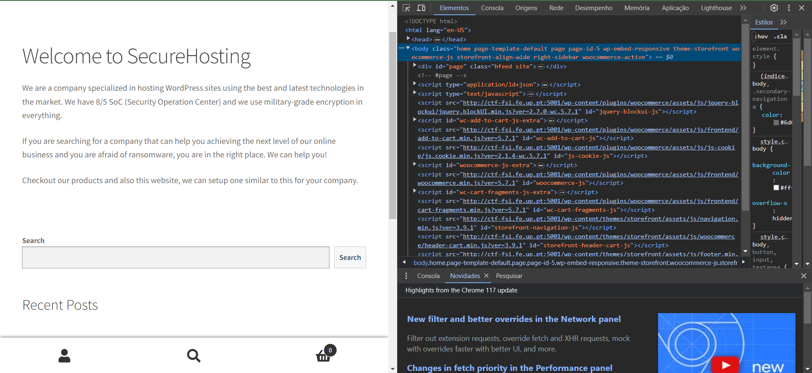

# CTF Writeup #0

O CTF da Semana #2 consiste em descobrir qual o CVE que permita ganhar acesso de administrador ao site.

### Fase de Reconhecimento

Na fase de reconhecimento, procurámos todo o tipo de informação que fosse útil num exploit que, neste caso, acabaram por ser as tecnologias usadas no site.

Através da ferramenta “Inspect” da página e acedendo às “Sources”, navegamos pelo site e conseguimos descobrir as tecnologias usadas, neste caso, wordpress, os respetivos plugins e versões.

No entanto, olhando só para os scripts pode não ser possível obter todas as versões usadas por todos os plugins, no entanto, pelo sim pelo o não, podemos guardar as versões de wordpress que são hosted por eles:

### Pesquisa por vulnerabilidades:

Com esta informação procurámos no site CVE.mitre.org vulnerabilidades destas versões e versões mais antigas que permitissem o acesso ao dashboard do wordpress de forma direta (logo certas vulnerabilidades como explorar um XSS para conseguir dar hijack à sessão do admin não são possíveis), visto que os gestores do website não têm interação com o site, neste caso.

### Escolha da vulnerabilidade:

Depois de uma rápida pesquisa encontrámos o CVE-[2021-34646](https://nvd.nist.gov/vuln/detail/CVE-2021-34646) , que explora uma vulnerabilidade no booster do woocommerce plugin, sem intervenção de um admin. Isto deve-se à logica de recuperar a password usar como código, um hash MD5 do tempo do request. Ou seja o atacante só têm de gerar várias hashes com tempos próximos do request e tentar uma até que funcione.

### Encontrar um exploit:

Procedemos a procurar no browser essa vulnerabilidade e encontrámos no site exploitdb.com: [WordPress Plugin WooCommerce Booster Plugin 5.4.3](https://www.exploit-db.com/exploits/50299)

### Explorar a vulnerabilidade:

Para finalizar executámos o script em python com o link do site e o ID como argumentos e este retornou links que davam acesso à página de reset password do admin.

Primeiro, corremos o script com o URL do website e com um id conhecido de um utilizador. Por norma, o id 1 é sempre a conta de admin, ou a primeira conta criada no wordpress.

Depois, ao clicar num dos 3 links conseguimos imediatamente ter acesso à conta de admin:

Logo agora é possível explorar à vontade toda a dashboard do wordpress e encontrar a flag:

