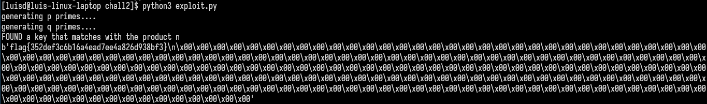

# CTF 10 - RSA

In this challenge we are given a RSA encrypted ciphertext and we have to try and decrypt it. In this case we are using plain RSA which to encrypt we do $m^{e}$ and to decrypt we do $(m^{e})^{d}$, assuming that m is the message we want to encrypt, e is the encrypting key or public key, and d is the decrypting key or the private key. We also are given the modulus associated and the public exponent.

RSA can be broken down in the following steps:

1. We choose two big enough primes (at least higher than $10^{100}$), p and q
2. We calculate n, the modulus, by multiplying p and q: $n = pq$
3. We find the Euler's totient function, also called the Euler's phi function by: $\phi(n) = (p-1)(q-1)$
4. We find the public expontent, e, by finding a number that is coprime between each other. Which means that there's no common divisor between e and $\phi(n)$
5. We find the decryption key, d, that follows the following condition: $de \equiv 1 (mod\ \phi(n)) $. We can use the extended euclidean algorithm to do this.
6. The message is encypted by doing the following calculation: $m^e$
7. Finally it can be decrypted at the other end using: $(m^{e})^{d}$


Normally RSA is a secure cipher if the primes involved in the calculation are big enough, which is the case of this CTF. However, the module that encrypted this message doesn't have a truly random prime generation, and on this case:

- p is a close prime of $2^{512}$
- q is a close prime of $2^{513}$

So we can use the Miller-Rabin miller to find close primes to those numbers in a quick manner (any other algorithm will take too long, because the Miller-Rabin can return non-prime numbers because it only tests a subset of them and if it's successful it assumes that the number is prime):

```python
def rabinMiller(num):
    # Returns True if num is a prime number.
    if num % 2 == 0 or num < 2:
        return False # Rabin-Miller doesn't work on even integers.
    if num == 3:
        return True
    s = num - 1
    t = 0
    while s % 2 == 0:
        # Keep halving s until it is odd (and use t
        # to count how many times we halve s):
        s = s // 2
        t += 1
    for trials in range(5): # Try to falsify num's primality 5 times.
        a = random.randrange(2, num - 1)
        v = pow(a, s, num)
        if v != 1: # This test does not apply if v is 1.
            i = 0
            while v != (num - 1):
                if i == t - 1:
                    return False
                else:
                    i = i + 1
                    v = (v ** 2) % num
    return True
```


Because the Miller-Rabin primality test is probablistic, we have to generate a few primes to hopefully get the right answer:

```python
def find_next_prime(number):
    i = 0
    while True:
        if rabinMiller(number + i):
            yield number + i
        if rabinMiller(number - i):
            yield number - i
        i += 1

print('generating p primes....')
p_primes = []
for i in find_next_prime(2**512):
    if(len(p_primes) == 20):
        break
    p_primes.append(i)


print('generating q primes....')
q_primes = []
for i in find_next_prime(2**513):
    if(len(q_primes) == 20):
        break
    q_primes.append(i)
```

And finally we can find the proper p and q for this cipher, by doing all cartesian product of all q_primes and p_primes (even though cartesian product is too overkill for this, it is quick enough for this) and check if any combination can match the public key:

```python


q = None
p = None

for i in itertools.product(q_primes, p_primes):
    if(i[0]*i[1] == n):
        q = i[0]
        p = i[1]
        print("FOUND a key that matches with the product n")
        break
else:
    print("couldn't find p and q that matches n")
```

Finally, having the original p and q we can decrypt the original message, by finding d first:

```python

def gcd(a, b):
    # Return the GCD of a and b using Euclid's Algorithm
    while a != 0:
        a, b = b % a, a
    return b


def findModInverse(a, m):
    # Returns the modular inverse of a % m, which is
    # the number x such that a*x % m = 1

    if gcd(a, m) != 1:
        return None # no mod inverse if a & m aren't relatively prime

    # Calculate using the Extended Euclidean Algorithm:
    u1, u2, u3 = 1, 0, a
    v1, v2, v3 = 0, 1, m
    while v3 != 0:
        q = u3 // v3 # // is the integer division operator
        v1, v2, v3, u1, u2, u3 = (u1 - q * v1), (u2 - q * v2), (u3 - q * v3), v1, v2, v3
    return u1 % m

phi = (p - 1)*(q - 1)

d = findModInverse(e, phi)

testMessage = enc(b"lmao", e, n)

print(dec(unhexlify(cipherText), d, n))
```

