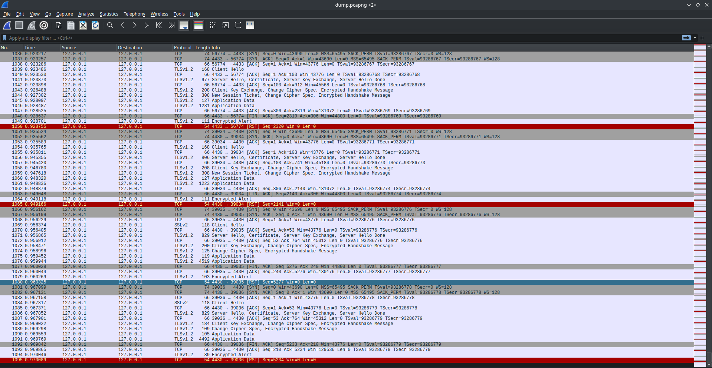
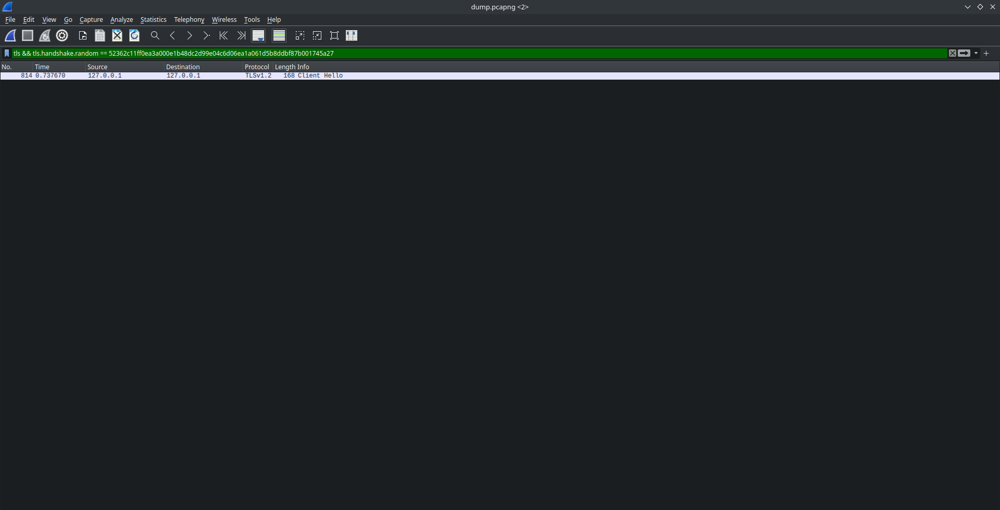
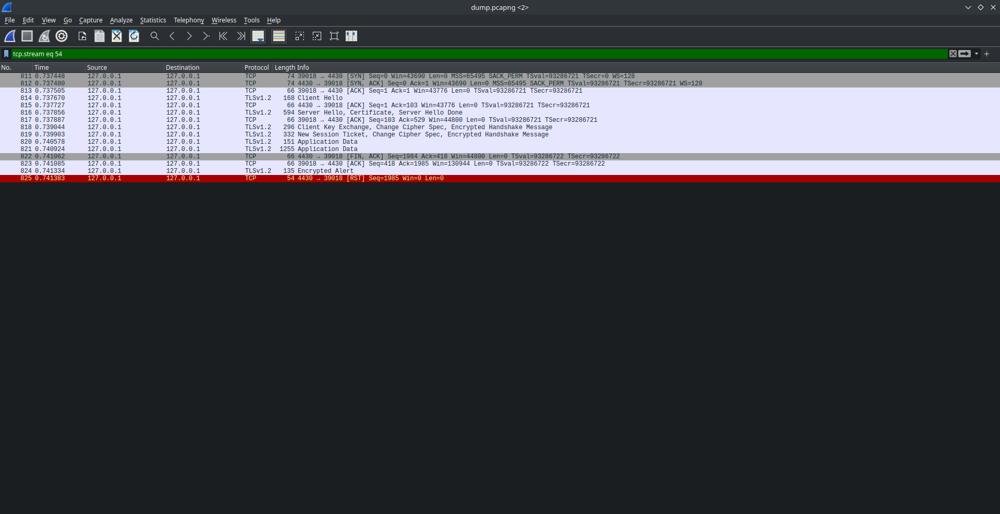
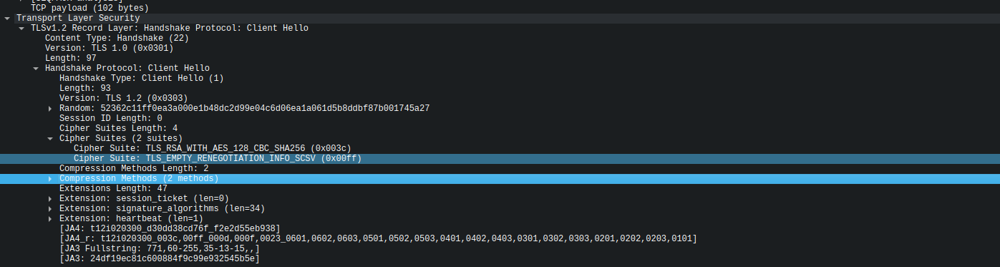
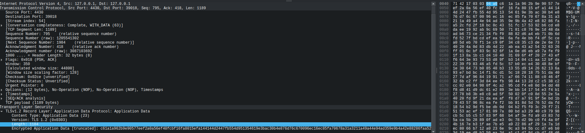
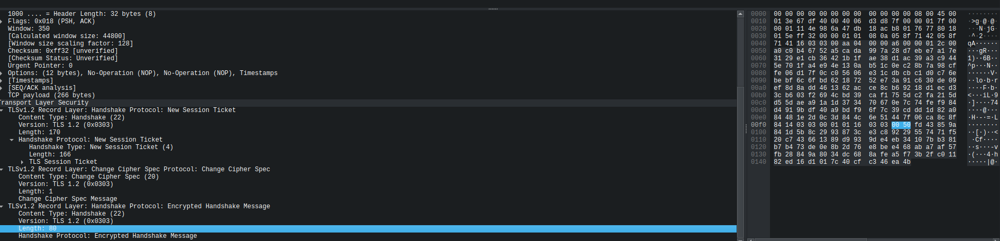

# CTF11 - Find my TLS

In this CTF, we are given a `.pcap` file which is a network capture that can include that computer traffic or a whole network's traffic. In order to open it, we use `Wireshark`, which is a packet sniffer and also a packet analyzer.

As we can see, we have over 1095 network frames of TLS traffic (TLS relies on TCP as a transport layer, so we sometimes see TCP packets from opening and closing connections) and it's too slow to analyse one by one to find the handshake with random number: `52362c11ff0ea3a000e1b48dc2d99e04c6d06ea1a061d5b8ddbf87b001745a27`.

Luckly we can leverage the powerful Wireshark's filters to narrow the packet and therefore to it's packet stream, using the following filter: 
`tls && tls.handshake.random == 52362c11ff0ea3a000e1b48dc2d99e04c6d06ea1a061d5b8ddbf87b001745a27`

By right clicking the packet and clicking on Follow > Follow TLS we can obtain the stream of packets

The final flag has the following structure: `flag{<frame_start>-<frame_end>-<selected_cipher_suite>-<total_encrypted_appdata_exchanged>-<size_of_encrypted_message>},`

- <frame_start> and <frame_end> are the first frame and the last frame of the TLS handshake, which starts on `Client Hello` and on this case (because the server and client support Session Tickets) ends on the `New Session Ticket`. Which means it starts on frame **814** and ends on frame **819**, we can further comprove that because the following frames correspond to TLS application data, which means the handshake already ended and we have a secure communication channel.

- <selected_cipher_suite> can be found by using the excelent wireshark packet analysis on the `Client Hello` packet:

In this case we can assume that the server will also use `TLS_RSA_WITH_AES_128_CBC_SHA256` because it's the only cipher suite that the client supports (and therefore the server must support it or deny the connection).

- <total_encrypted_appdata_exchanged> can be obtained by looking the `Application Data` packets and try look for the app data length inside of the packet: 

Because we have 2 `Application Data` packets we have two sum the two lengths:  $80+1184 = 1264$

- <size-of-encrypted-message> we can find on the last handshake packet: 

Now we can obtain the final flag:

`flag{814-819-TLS_RSA_WITH_AES_128_CBC_SHA256-1264-80}`