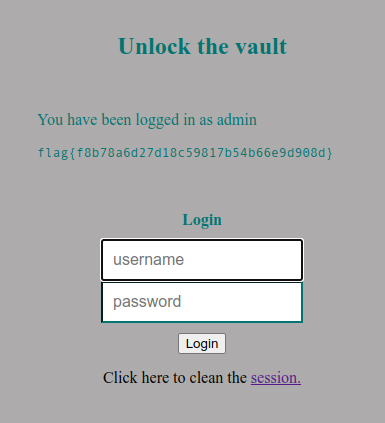

# CTF 8 - SQL Injection


By going to `http://ctf-fsi.fe.up.pt:5003/` we get the following page:


We get a username and password dialog, which it's unpratical to bruteforce we can look at the provided index.php site at the `POST` request logic:

```php
               require_once 'config.php';

               $username = $_POST['username'];
               $password = $_POST['password'];
               
               $query = "SELECT username FROM user WHERE username = '".$username."' AND password = '".$password."'";
                                     
               if ($result = $conn->query($query)) {
                                  
                  while ($data = $result->fetchArray(SQLITE3_ASSOC)) {
                    $_SESSION['username'] = $data['username'];
           
                    echo "<p>You have been logged in as {$_SESSION['username']}</p><code>";
                    include "/flag.txt";
                    echo "</code>";

                 }
               } else {            
                   // falhou o login
                   echo "<p>Invalid username or password <a href=\"index.php\">Tente novamente</a></p>";
               }
```

We can see that the query in the source code, does not use prepared statements and use string concatenation to insert the elements into the query:

```php
$query = "SELECT username FROM user WHERE username = '".$username."' AND password = '".$password."'";
```

Therefore we can try to inject SQL into the username part since it's the first parameter and try to login regardless of knowing the username/password or not:


We can put anything on the password field because it will be ignored since after the username parameter everthing will become a comment:

