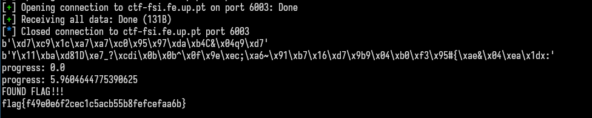

# CTF 9 - Weak Encryption

By analyzing the `cipherspec.py` we can see that it uses AES encryption, which by itself, is very secure and it uses a battle tested implementation of AES. However, we can see while the program tecnically uses 16 byte strings as it's key, only 3 of them are random:

```python
KEYLEN = 16

def gen(): 
	offset = 3 # Hotfix to make Crypto blazing fast!!
	key = bytearray(b'\x00'*(KEYLEN-offset)) 
	key.extend(os.urandom(offset))
	return bytes(key)
```

Which reduces the total key combinations from `2^128` to `2^24`, or _only_ 16777216 combinations, which can be bruteforced relatively fast on a modern computer, with the following code: 

```python
from pwn import * 
import binascii
import cipherspec
import sys
from multiprocessing import Pool, TimeoutError
io = remote('ctf-fsi.fe.up.pt', 6003)
buf = io.recvall().decode(encoding='ascii').split('\n')


nonce = binascii.unhexlify(buf[0][7:])
ciphertext = binascii.unhexlify(buf[1][12:])

print(nonce)
print(ciphertext)

KEYLEN = 16
OFFSET = 3

key = b'\x00'*(KEYLEN)


for i in range(pow(2, OFFSET*8)):
    if i % 1000000 == 0:
        print(f'progress: {(i/pow(2, OFFSET*8)) * 100}')
    try:
        decoded = cipherspec.dec(key, ciphertext, nonce).decode('ascii')
        if(decoded.startswith('flag')):
            print('FOUND FLAG!!!')
            print(decoded)
            sys.exit(0)
    except SystemExit:
        sys.exit(0)
    except:
        pass
    key = b'\x00'*(KEYLEN-OFFSET) + i.to_bytes(OFFSET, 'little')
```

This script, connects to the server and gets all the information. On every key iteration, we check if it can be decoded by ascii, and if starts with `flag`, otherwise we skip it to the next key.

