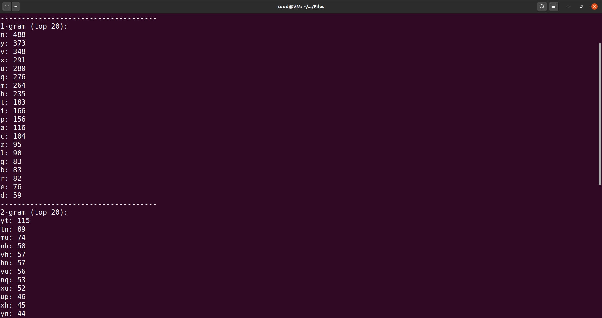
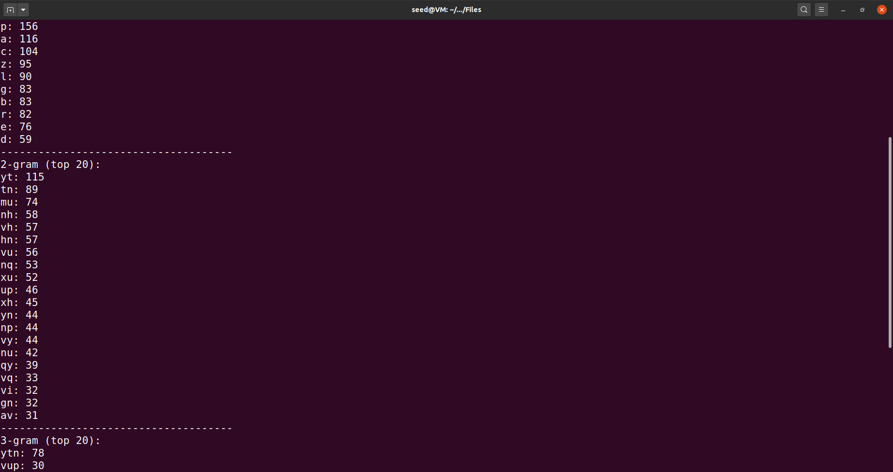
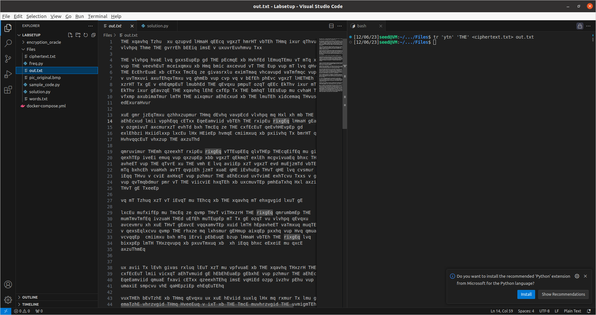
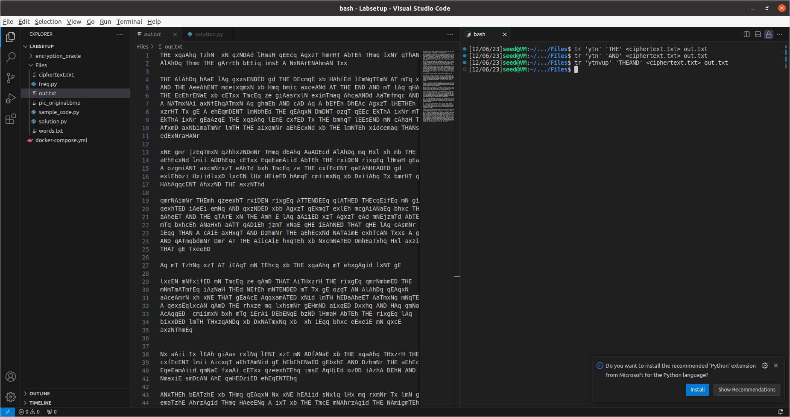
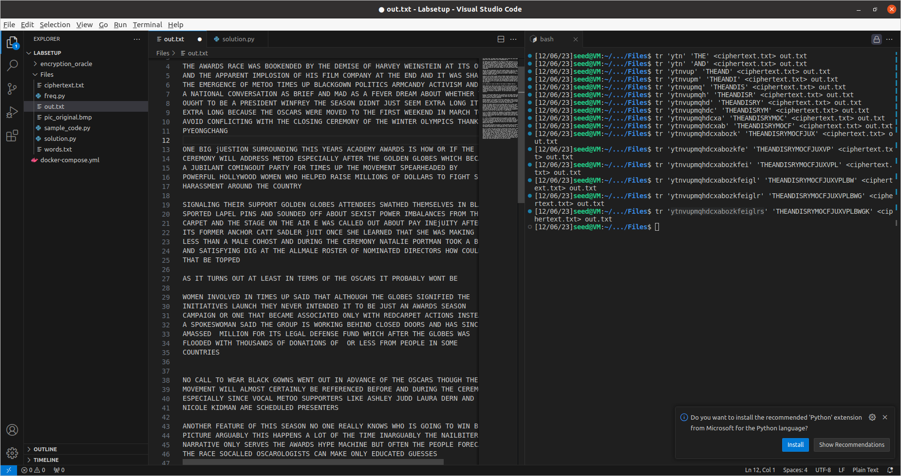
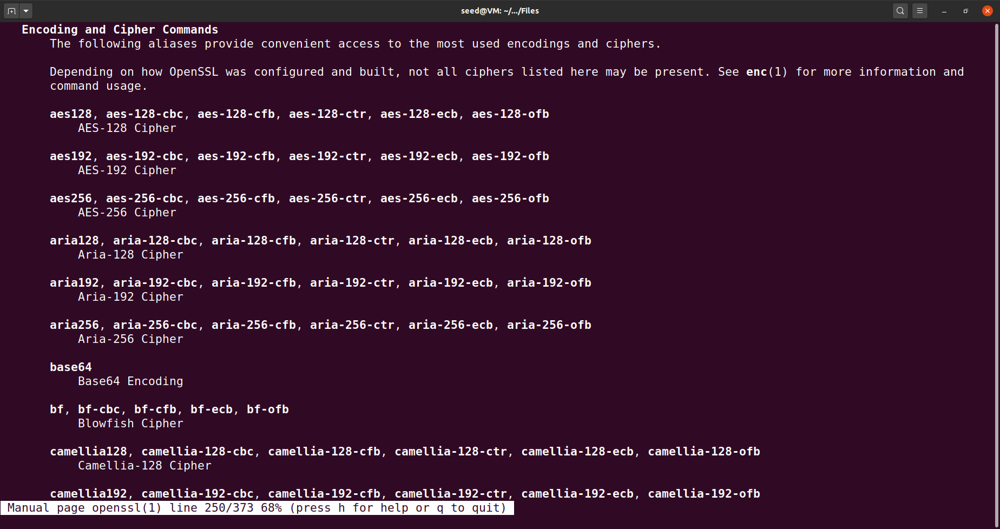
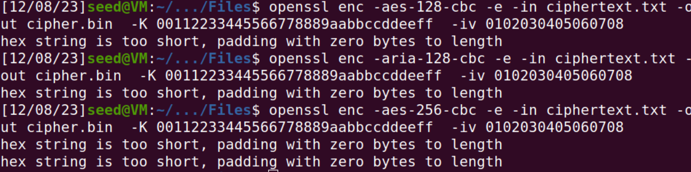
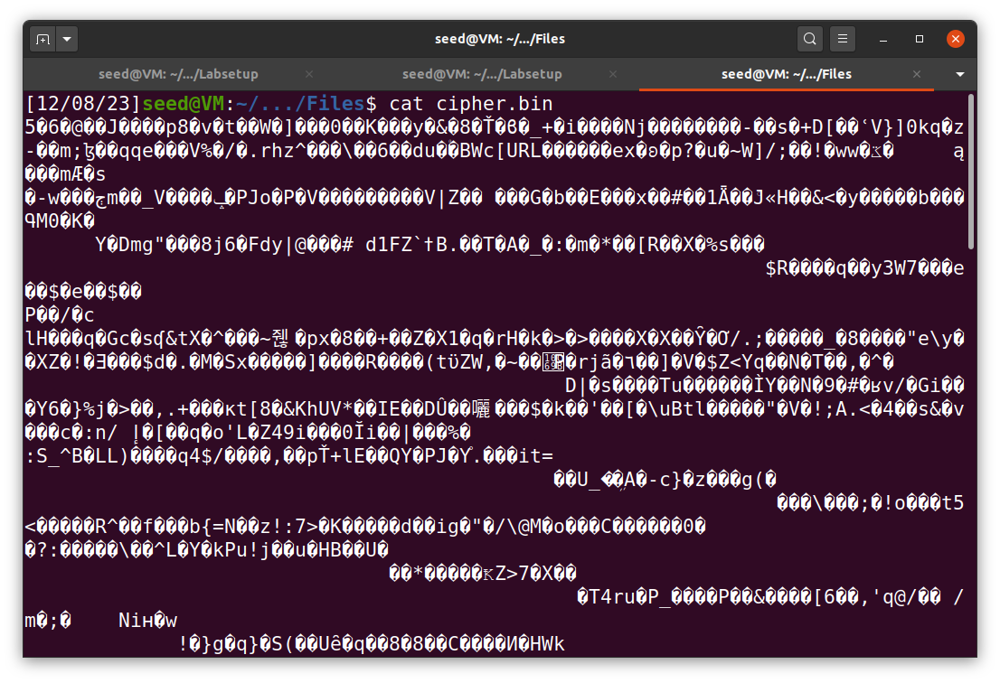
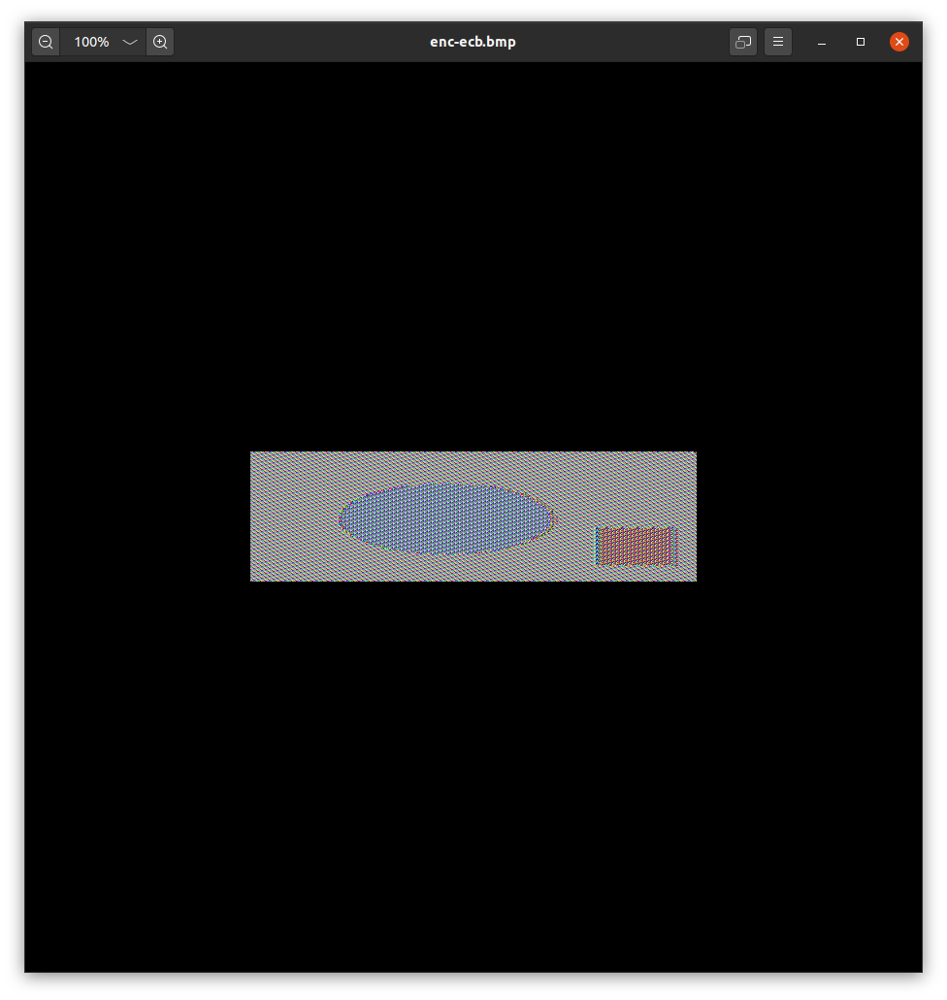
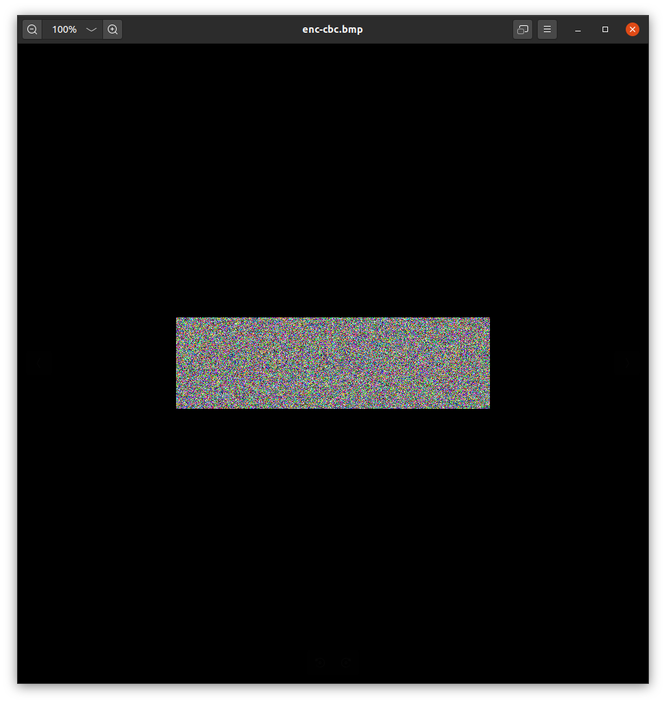

# LOGBOOK10.md

## Task 1

Nesta task, é-nos fornecido um artigo em inglês encriptado usando uma cifra monoalfabética. Uma cifra monoalfabética é uma cifra em que cada letra do texto original é substituída por outra letra, em que a substituição não varia.

Para desencriptar o artigo, começamos por correr o script `[freq.py](http://freq.py)` . Este script retorna-nos um ranking com as letras mais frequentes, bem como as combinações de 2 e 3 letras mais frequentes. Com isto, podemos começar a tentar trocar algumas das letras/combinações mais frequentes no ficheiro pelas letras/combinações mais frequentes na língua inglesa, como por exemplo a palavra “the” ou a palavra “and”.





Para tentar substituir, usamos o comando `tr`, fornecendo um ficheiro de input (`cipher.txt`) e um ficheiro de output (`out.txt`), e especificando os caracteres que vão ser substituídos numa string e os caracteres que vão substituir noutra string, respetivamente.

Vamos tentando substituir as letras com base nas que vamos descobrindo anteriormente, tentando formar palavras que façam sentido.





Assim, conseguimos decifrar o artigo.



## Task 2

Nesta task, experimentamos alguns modos e algoritmos de encriptação diferentes.

Começamos por experimentar o comando `openssl enc`, que é usado para encriptar ou desencriptar um ficheiro. 

```pascal
$ openssl enc -ciphertype -e -in plain.txt -out cipher.bin \
-K 00112233445566778889aabbccddeeff \
-iv 0102030405060708
```



Nesta tarefa, experimentamos a cifra aes-128-cbc, aria-128-cbc e aes-256-cbc.





## Task 3

Na última task, encriptamos a imagem `pic_original.bmp`, de maneira a que o conteúdo da foto só seja percetível para quem tiver a cifra.

[inserir aqui print de nós a encriptar e escrever sobre o modo que usamos para encriptar)

De maneira à fotografia encriptada ser aceite como uma fotografia legítima, temos de manter alguns dos dados do ficheiro intactos. Um ficheiro do tipo `.bmp` contém a informação a informação do header nos primeiros 54 bytes. Deste modo, substituímos o header da fotografia encriptada pelo header original, usando os comandos abaixo, que permitem juntar as partes que queremos do ficheiro original com as partes que queremos do ficheiro encriptado e retorná-las num novo ficheiro.

```pascal
$ head -c 54 p1.bmp > header
$ tail -c +55 p2.bmp > body
$ cat header body > new.bmp
```

Tendo encriptado a fotografia usando tanto EBC (electronic code book) como CBC (cipher block chaining), pudemos verificar que existem algumas diferenças entre os dois.

Com ECB, cada bloco é encriptado individualmente. Apesar do processo de encriptação ser mais rápido e poder ser paralelizado, isto faz com que o possam ser passados alguns dados sobre a imagem. Como podemos ver na imagem abaixo, alguns dos elementos continuam a ser identificáveis ou deduzíveis.



No caso de CBC, cada bloco de informação da imagem é encriptado usando o bloco encriptado imediatamente antes (com um XOR). Cada bloco depende do anterior, não podendo o processo ser paralelizado, mas, como podemos ver pela imagem, é muito mais eficaz na proteção da informação contida numa imagem.

