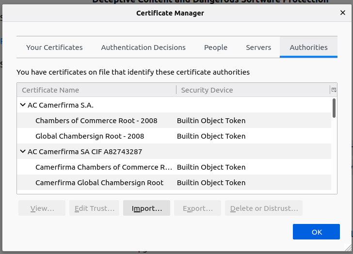
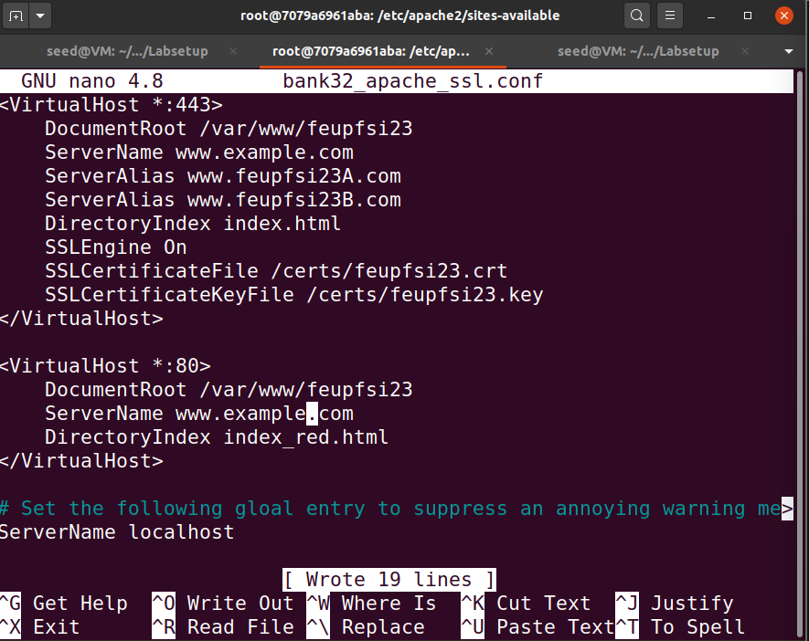

# LOGBOOK11.md

## Lab Environment

### 1. Container Setup e Comandos

Primeiro, demos setup ao docker.

### 2. DNS setup

Depois, demos set up a um web server de HTTPS (`www.feupfsi23.com`), usando `/etc/hosts`. Isto mapeia o nosso server ao endereço IP do container.

## Task 1

### The Configuration File

Começamos por tentar tornar-nos uma Certificate Authority, de maneira a sermos uma podermos emitir certificados digitais. O OpenSSL é usado para criar estes certificados.

Para podermos usá-lo, é necessário um ficheiro de configuração - `openssl.cnf`. O OpenSSL usa por default o ficheiro de configuração em `/usr/lib/ssl/openssl.cnf`, que nós copiamos para a nossa diretória para poder fazer algumas alterações.

De seguida, descomentamos a linha `#unique_subject = no`, para permitir a criação de vários certificados com o mesmo subject. 


Depois criamos o ficheiro `index.txt`, deixando-o vazio, e inserimos no ficheiro `serial` um número em formato string.

### Certificate Authority (CA)

Para criar um certificado self-signed para a nossa CA, de maneira a confirmar que esta é de confiança. Para isso corremos o comando abaixo.

```bash
openssl req -x509 -newkey rsa:4096 -sha256 -days 3650 \ -keyout ca.key -out ca.crt
```

A este ponto, foi-nos pedido para definir uma palavra-passe, que vamos usar cada vez que esta CA for assinar certificados.

Os ficheiros ca.key e ca.crt passaram a conter as chaves privada e pública da CA, respetivamente.

Para verificar os conteúdos do certificado X509 e da chave RSA, corremos os seguintes comandos, respetivamente.

```bash
openssl x509 -in ca.crt -text -noout
openssl rsa -in ca.key -text -noout
```


- What part of the certificate indicates this is a CA’s certificate?
• What part of the certificate indicates this is a self-signed certificate?
• In the RSA algorithm, we have a public exponent e, a private exponent d, a modulus n, and two secret
numbers p and q, such that n = pq. Please identify the values for these elements in your certificate
and key files.

Podemos verificar que é um certificado de uma CA na seguinte imagem, visto que tem `CA: TRUE`.


Também podemos confirmar que o certificado é self-signed porque os campos `Issuer` e `Subject` são os mesmos.

Para além disso, como podemos verificar nas imagens abaixo o ficheiro é constituído por dois números primos (`prime1` e `prime2`), pelo `modulus` , os expoentes públicos e privados (`publicExponent` e `privateExponent`).


## Task 2

Nesta task, geramos um pedido de assinatura de certificado para o nosso server.

Começamos por usar o comando abaixo para gerar o CSR (pedido de assinatura de certificado)

```pascal
openssl req -newkey rsa:2048 -sha256 \
-keyout server.key -out server.csr \
-subj "/CN=www.feupfsi23.com/O=l11g09 Inc./C=US" \
-passout pass:dees
```

Com isto, é gerado um par de chaves pública/privada e criado um CSR, que podem ser verificados através dos seguintes comandos, respetivamente.

```pascal
openssl req -in server.csr -text -noout
openssl rsa -in server.key -text -noout
```

Também adicionamos domínios alternativos, nomeadamente `[www.feupfsi23A.com](http://www.feupfsi23.com)` e `[www.feupfsi23B.com](http://www.feupfsi23.com)`, usando o o comando abaixo.

```pascal
-addext "subjectAltName = DNS:www.feupfsi23.com, \
													DNS:www.feupfsi23A.com, \
													DNS:www.feupfsi23B.com"
```


## Task 3

Para termos um certificado, o ficheiro CSR tem de ter a assinatura de uma CA, que neste caso é a nossa.

Começamos então por descomentar a linha abaixo, que nos vai permitir copiar o campo da extensão do pedido para o certificado final.

```pascal
# Extension copying option: use with caution.
copy_extensions = copy
```


Com isto, podemos prosseguir com o comando abaixo, que faz com que o nosso pedido (`server.csr`) se torne num certificado X509 (`server.crt`). 

```pascal
openssl ca -config myCA_openssl.cnf -policy policy_anything \
-md sha256 -days 3650 \
-in server.csr -out server.crt -batch \
-cert ca.crt -keyfile ca.key
```

Depois de fazer isto, usamos o comando `openssl x509 -in server.crt -text -noout` para verificar o conteúdo do certificado e se os domínios alternativos estão incluídos.

## Task 4

Nesta task, vemos como os certificados de chave-pública são usados para garantir uma navegação com segurança. Usamos um servido Apache que suporta o protocolo HTTPS. 

Começamos por configurá.lo, mudando o ficheiro `bank32_apache_ssl.conf` como podemos ver abaixo:

```pascal
<VirtualHost *:443> 
    DocumentRoot /var/www/fsi2023
    ServerName www.fsi2023.com
    ServerAlias www.fsi2023A.com
    ServerAlias www.fsi2023B.com
    DirectoryIndex index.html
    SSLEngine On 
    SSLCertificateFile /certs/fsi2023.crt
    SSLCertificateKeyFile /certs/fsi2023.key
</VirtualHost>

<VirtualHost *:80> 
    DocumentRoot /var/www/fsi2023
    ServerName www.fsi2023.com
    DirectoryIndex index_red.html
</VirtualHost>

# Set the following gloal entry to suppress an annoying warning message
ServerName localhost
```


Depois iniciamos o servidor Apache, usando o comando abaixo numa shell dentro do container.

```pascal
$ service apache2 start
```


Depois, copiamos os ficheiros `server.ctf` e `server.key` para a pasta partilhada entre a VM e o container.


Ao tentarmos aceder ao site (`https://feupfsi2023.com`), reparamos que a ligação não é segura.


Para conseguirmos que esta seja segura, temos de adicionar o nosso certificado ao browser. Na search bar do firefox, escrevemos `about:preferences#privacy` de maneira a encontrar as definições de segurança e adicionar a nossa CA para aprovar websites e e-mails. Deste modo, o browser passa a confiar na nossa CA para tudo isto.




Assim, passamos a ter acesso ao nosso website sem avisos.


## Task 5

Nesta task, tentamos um ataque Man in the Middle. Usamos `[www.example.com](http://www.example.com)` para ser o nosso website original.

Primeiro, adicionamos a linha `10.9.0.80   [www.example.com](http://www.example.com)` a `etc/hosts` .


De seguida, alteramos o ficheiro `bank32_apache_ssl.conf` de maneira a que o ServerName seja `www.example.com`.

```pascal
<VirtualHost *:443> 
    DocumentRoot /var/www/fsi2022
    ServerName www.example.com
    ServerAlias www.fsi2022A.com
    ServerAlias www.fsi2022B.com
    DirectoryIndex index.html
    SSLEngine On 
    SSLCertificateFile /certs/fsi2022.crt
    SSLCertificateKeyFile /certs/fsi2022.key
</VirtualHost>

<VirtualHost *:80> 
    DocumentRoot /var/www/fsi2022
    ServerName www.example.com
    DirectoryIndex index_red.html
</VirtualHost>

# Set the following gloal entry to suppress an annoying warning message
ServerName localhost
```



Ao tentarmos aceder ao site, temos o mesmo problema que tivemos anteriormente no que toca ao site não ser seguro. No entanto, desta vez é porque estamos a usar o mesmo certificado que já está a ser usado no `www.feupfsi2023.com`.

## Task 6

Quando uma CA está comprometida, esta pode ser usada para garantir certificados a sites maliciosos. Deste modo, podemos criar um certificado para o nosso novo site `[www.example.com](http://www.example.com)` .

Para isto, basta repetir o processo que fizemos anteriormente com `[www.feupfsi2023.com](http://www.feupfsi2023.com)` na task 2 e conseguimos com o que o o novo site seja considerado seguro.