# LOGBOOK12.md

# Lab Environment

## 1. Container Setup and Commands

Primeiro, começamos por dar setup ao Docker. Tivemos de criar três containers diferentes para conseguirmos simular três máquinas diferentes: o Attacker, o Host A e o Host B.

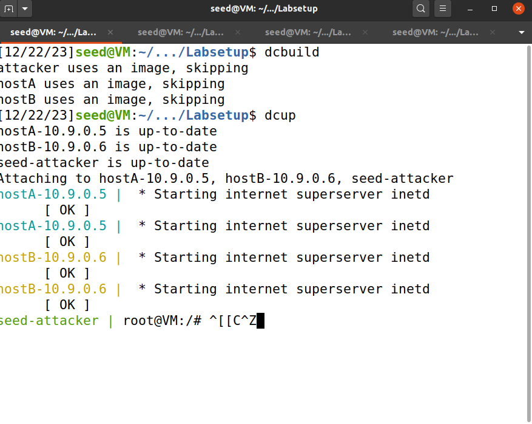

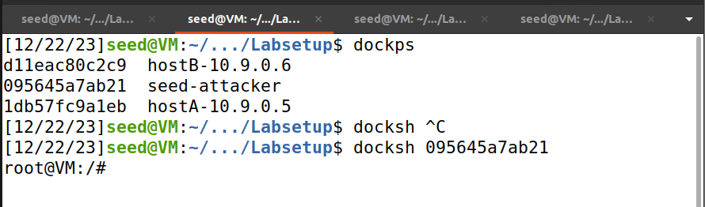

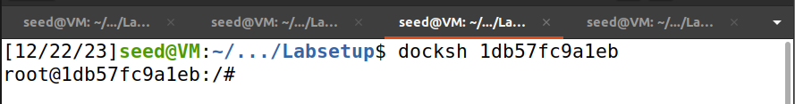

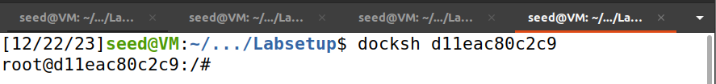

## 2. About the Attacker Container

De seguida, procuramos o nome da interface da rede. Para isto, usamos o comando `ifconfig` , que nos mostra várias interfaces de rede. O nome da rede que procuramos é o que está associado ao endereço IP 10.9.0.1 (logo o primeiro que nos aparece) - `br-15d9ab541510`.

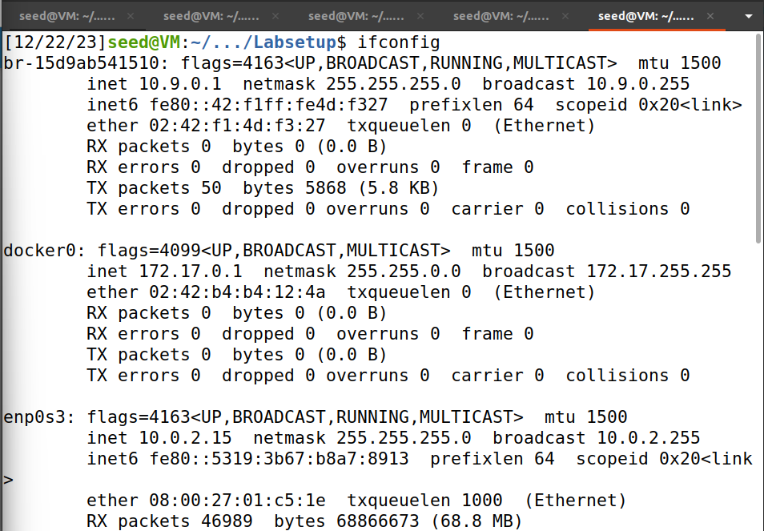

# Task 1 - Using Scapy to Sniff and Spoof Packets

Para esta Task, vamos usar o Scapy. O Scapy é uma ferramenta usada para sniffing and spoofing, mas também funciona como bloco de construção de outras ferramentas de sniffing and spoofing.

Para usar esta ferramenta, tivemos de correr um programa de python fornecido no guião do lab.

```python
# python3
from scapy.all import*
a = IP()
a.show()
###[ IP ]
###version   = 4
ihl       = None
...
```

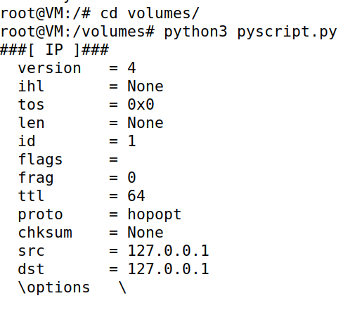

## 1.1 Sniffing Packets

Sniffing é a captura e analise de pacotes de dados à medida que estes vão sendo enviados numa rede de computadores

Para fazer sniffing, vamos usar, mais uma vez, um script fornecido no lab, que exemplifica como fazer packet sniffing com o Scapy em programas de Python.

```python
#!/usr/bin/env python3
from scapy.all import *

def print_pkt(pkt):
    pkt.show()

pkt = sniff(iface='br-15d9ab541510', filter='icmp', prn=print_pkt)
```

O `iface` é o nome da rede que encontramos usando o comando `ifconfig` na preparação do ambiente para o lab.

### 1.1 A

Nesta alínea, analisamos a possibilidade de enviar packets no container do atacante. Para isto, corremos o código acima no ficheiro `pyscript.py`.

Primeiro, experimentamos fazê-lo com privilégios de root. Depois de correr o ficheiro, tentamos dar `ping` para verificar a conexão entre o `hostA` e o `hostB`. Como podemos verificar abaixo, o script funcionou e conseguimos capturar pacotes.

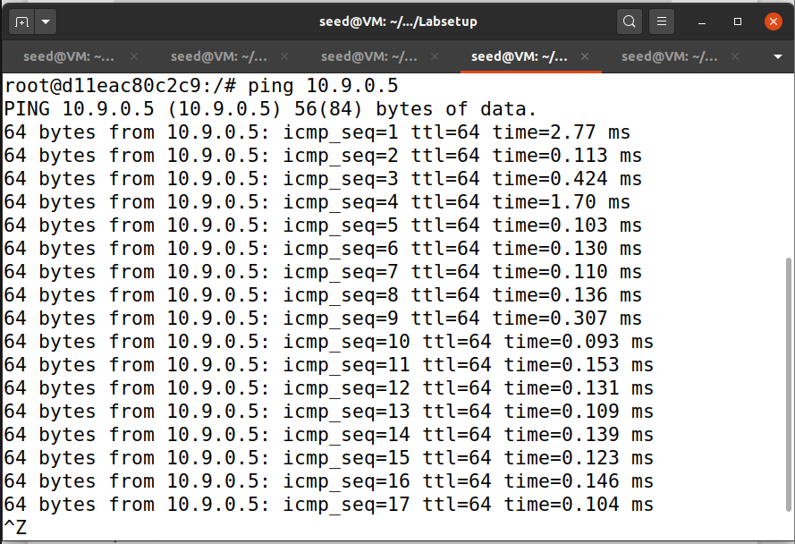

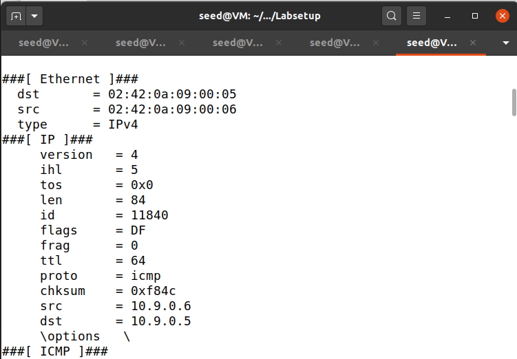

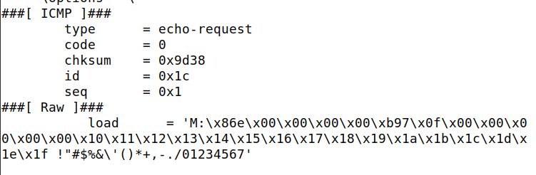

No entanto, ao experimentar sem os privilégios de root, verificamos que não foi possível fazer sniffing - `Operation not permitted`.

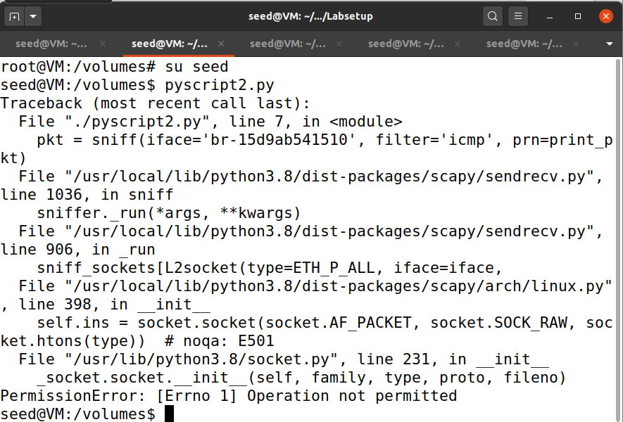

### 1.1 B

Nesta task, exploramos os filtros no âmbito do sniffing.

Muitas vezes quando estamos a tentar fazer sniffing, temos interesse em algum tipo de packets, e é daí que surgem os filtros. 

Em primeiro lugar, filtramos os packets com o protocolo ICMP. Para isto corremos o script abaixo (`pyscript2.py`) e demos `ping` com o `hostA`.

```python
#!/usr/bin/env python3
from scapy.all import *

def print_pkt(pkt):
    pkt.show()

pkt = sniff(iface='br-15d9ab541510', filter = 'ICMP', prn=print_pkt)
```

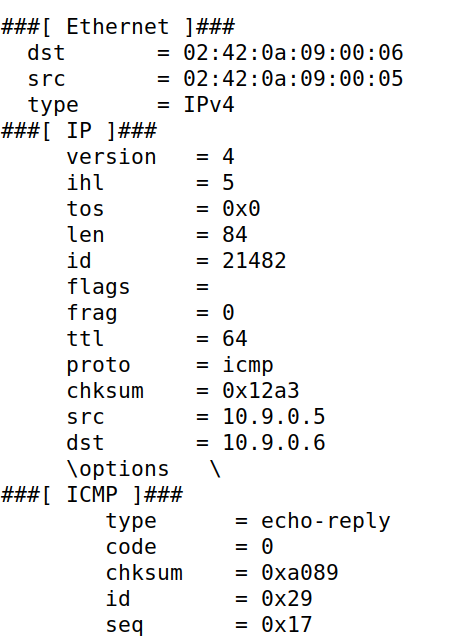

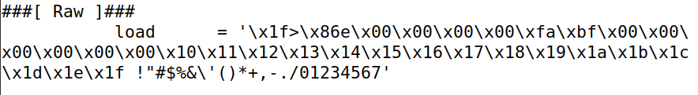

Em segundo lugar, tentamos capturar um packet TCP um IP específico (`10.9.0.5`) e cuja porta de destino fosse 23.
Alterando o script e usando o `hostA` para tentar enviar uma mensagem para essa porta (`echo 'epa'> /dev/tcp/10.9.0.6/23`), conseguimos capturar o pacote abaixo.

Podemos verificar que a porta é a que procurávamos, visto ser o serviço Telnet que geralmente está associado à porta 23.

```python
#!/usr/bin/env python3
from scapy.all import *

def print_pkt(pkt):
    pkt.show()

pkt = sniff(iface='br-15d9ab541510',A filter = 'tcp && src host 10.9.0.5 && dst port 23', prn=print_pkt)
```

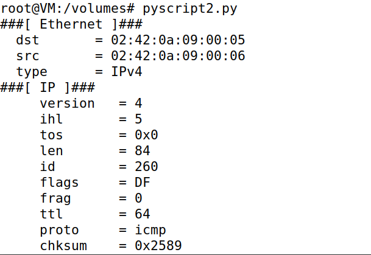

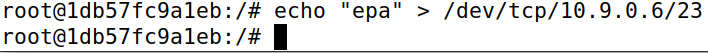

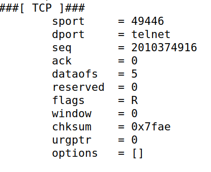

Em terceiro lugar, tentamos capturar apenas packets associados a uma subnet específica.

Para garantir que não utilizávamos a subnet da nossa própria VM, utilizamos o IP fornecido no lab - `128.230.0.2`.

Tentando dar `ping` no `hostA`, conseguimos mais uma vez capturar o packet pretendido.

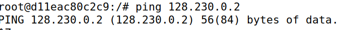

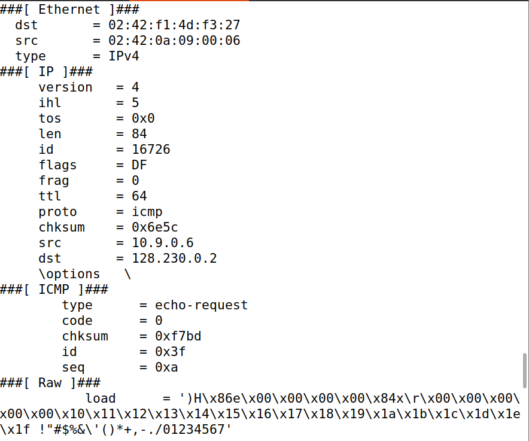

## 1.2 Spoofing ICMP

Spoofing envolve o envio de pacotes IP com um endereço de origem falso, de modo a que o atacante se faça passar por outra entidade.

Na task 1.2, tentamos fazer spoofing com um packet ICMP de um source “falso” `10.9.0.5` para a destination `10.9.0.6` . 

Para fazer isto, corremos o script abaixo. Neste script, criamos um `IP` e a este associamos o `src` e `dst` . De seguida, criamos um protocolo `ICMP` e usamos `/` para concatenar os diferentes protocolos num packet novo. Por fim, enviamos o packet.

```python
from scapy.all import*
a = IP()
a.src = '10.9.0.5'
a.dst = '10.9.0.6'
b = ICMP()
p = a/b
send(p)
```

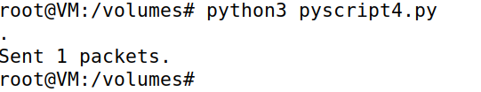

Verificando o Wireshark, pudemos concluir que recebemos um packet como resposta, pelo que a nossa tentativa de spoofing foi bem sucedida.

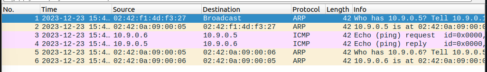

Também através do comando `ls(a)` verificamos que o `src` e o `dst` foram alterados para os valores que definimos no script.

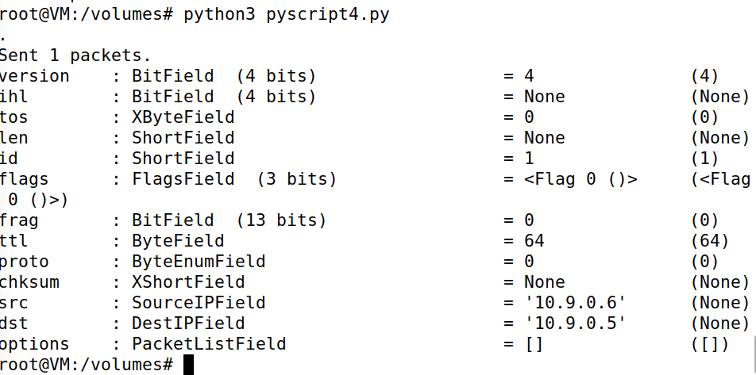

## 1.3 Traceroute

Traceroute é uma ferramenta que estima a rota de um packet através de uma rede de computadores.

Nesta task, tentamos usar o Scapy para criar uma ferramenta que faça o mesmo, de maneira a estimarmos a distância entre a nossa VM e um destino selecionado por nós.

Começamos por enviar um packet com o Time-To-Live (TTL) a 1, ou seja, passando apenas pelo primeiro router. Usamos o código abaixo para enviar o packet para o destino `8.8.8.8`.

```python
from scapy.all import*
a = IP()
a.dst = '8.8.8.8'
a.ttl = 1
b = ICMP()
send(a/b)
```

No Wireshark podemos ver que o packet foi enviado, mas o Time-To-Live foi excedido.

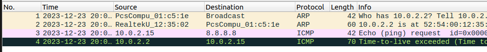

A partir daqui, começamos a aumentar o Time-To-Live progressivamente até chegarmos ao endereço desejado. Para fazer isto, a cada tentativa, aumentamos o valor maior do `range` do ciclo `for`.

```python
from scapy.all import *

a = IP()
a.dst = '8.8.8.8'
b = ICMP()

for i in range(1,3): #Começamos com 3 e vamos aumentando
    send(a/b)
```

Quando pusemos o `range` do TTL de 1 a 16 (exclusivé), conseguimos obter uma resposta com origem em `8.8.8.8`, ou seja, a distância da nossa VM ao nosso destini é de 15.

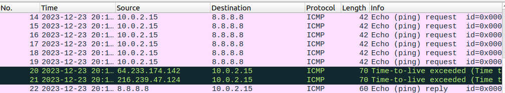

## 1.4 Sniffing and-then Spoofing

Na última task, criamos um programa para fazer sniffing e spoofing em conjunto. Essencialmente, capturamos packets que estão a ser enviados para outros endereços (sniffing) e respondemos a esses packets, fazendo-nos passar pelo destinatário original (spoofing).

Começamos por criar o programa abaixo, baseando-nos nas tasks anteriores. 

Primeiro, usamos o comando sniff para capturar os packets que queremos, nomeadamente `ICMP`

De seguida, verificamos se o packet é do tipo `ICMP` (ou seja, tipo 8). Se for, prosseguimos e criamos um `IP`, ao qual associamos a origem e o destino contrários ao do packet.

Criamos também um `ICMP`, ao qual associamos os seguintes valores:

- `b.type = 0` - 0 é o tipo do echo reply
- `b.id = p[ICMP].id` - o mesmo id do packet original, de maneira a associar o echo reply ao echo request
- `b.seq = p[ICMP].seq` - a mesma seq do packet original, de maneira a associar o echo reply ao echo request
- `load = p[Raw].load` - extrai o payload do packet original, ou seja, os dados da mensagem enviada pelo emissor original

Por último, concatenamos os três protocolos e enviamos o packet resultante.

```python
from scapy.all import*

def sniff_and_then_spoof(p):
    if p[ICMP].type != 8:
        return
    
    a = IP()
    a.src = p[IP].dst  # destino do packet é a origem de a
    a.dst = p[IP].src  # origem do packet é o destino de a

    b = ICMP()
    b.type = 0  # echo reply
    b.id = p[ICMP].id
    b.seq = p[ICMP].seq
    load = p[Raw].load

    send(a / b / load)

p = sniff(iface='br-15d9ab541510', filter='icmp', prn=sniff_and_then_spoof)
```

O primeiro endereço que usamos para dar `ping` foi o `1.2.3.4`. Pudemos verificar que o nosso sniff and then spoof funcionou

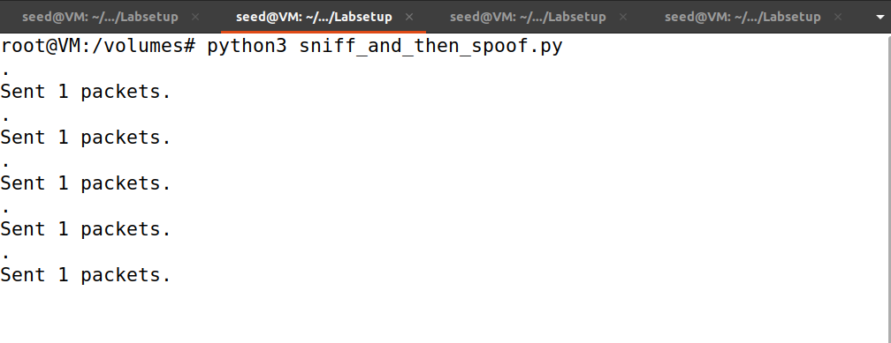

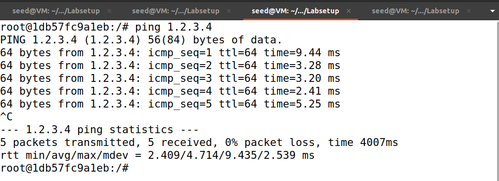

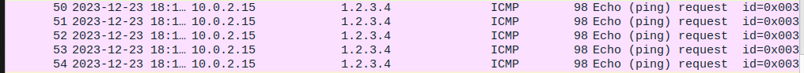

De seguida, tentamos com `10.9.0.99`, um host na LAN que não existe. Neste caso, não conseguimos que os packets de resposta chegassem ao destino.

A mensagem `Destination Host Unreachable` e a falha do protocolo `ARP` indicam que não conseguimos encontrar este host na rede local.

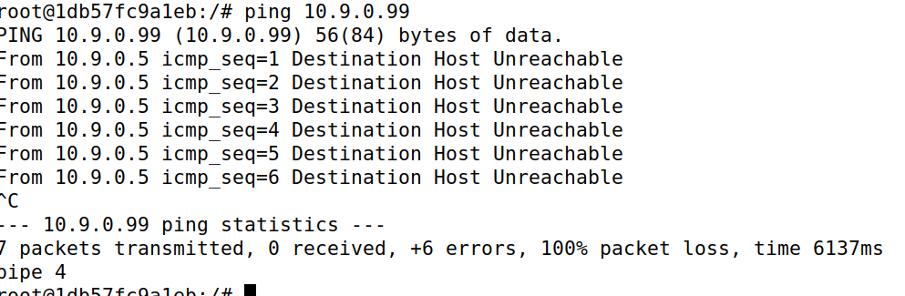

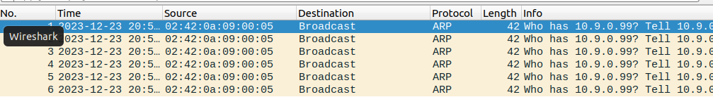

Por último, experimentamos com `8.8.8.8`, um host na Internet.

Neste caso, recebemos alguns duplicados, que se devem ao facto da internet ser uma rede mais complexa e dinâmica.

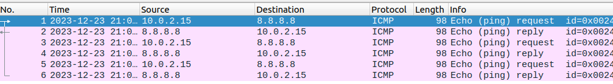

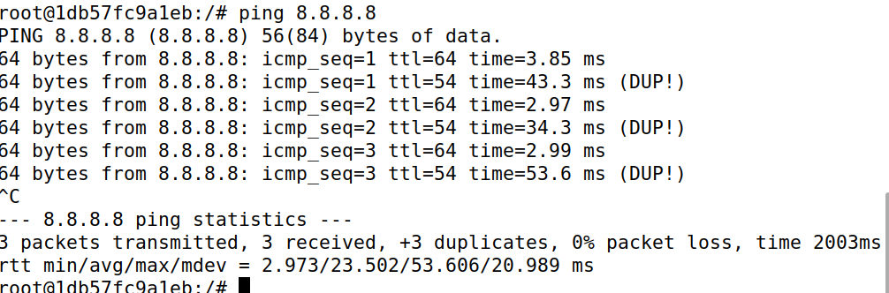
