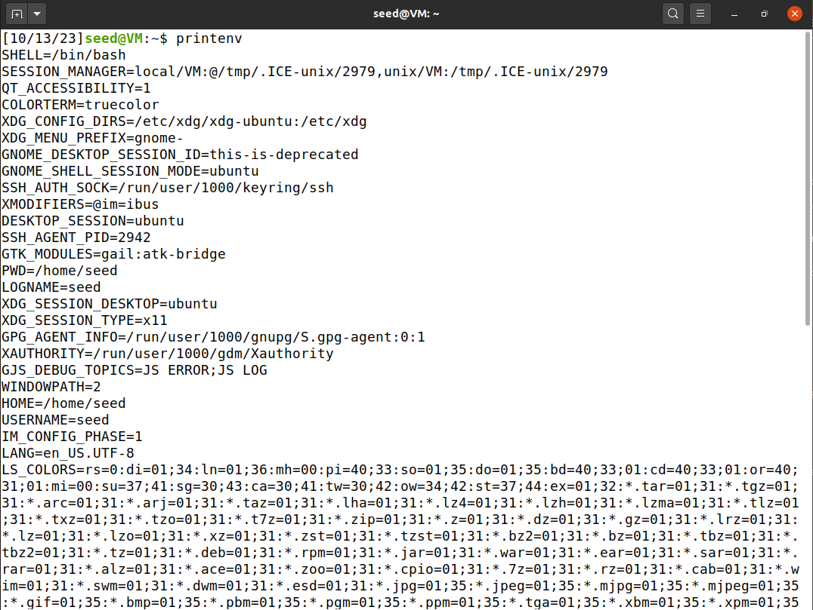
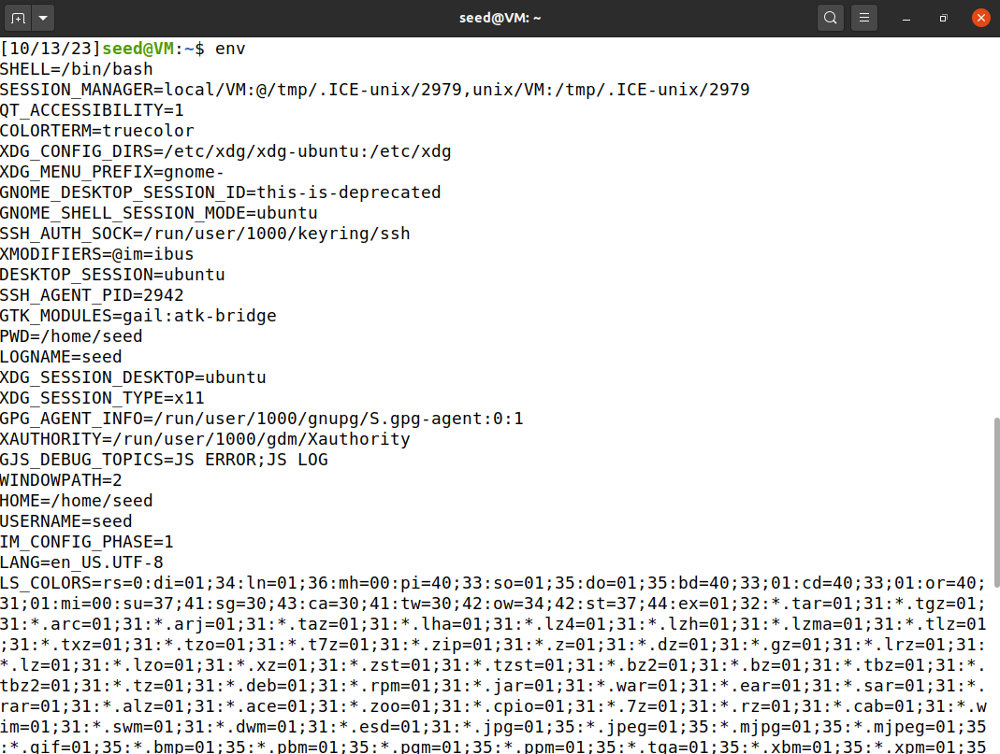
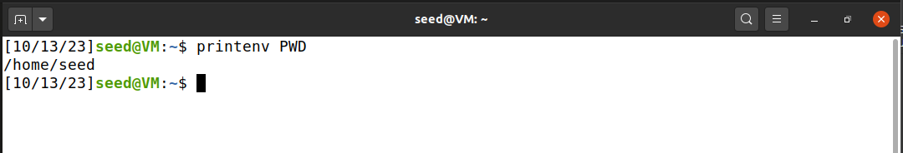
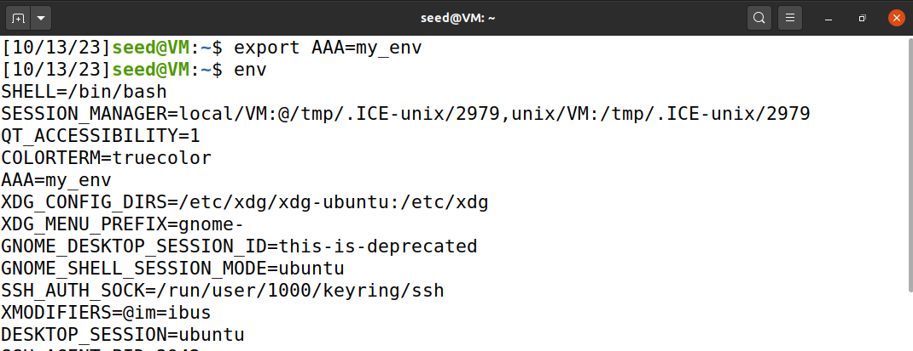
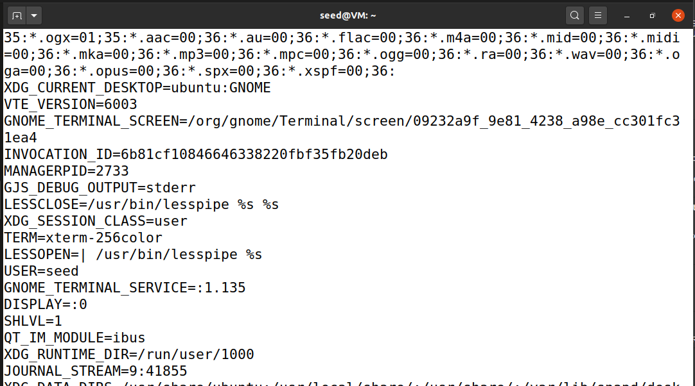
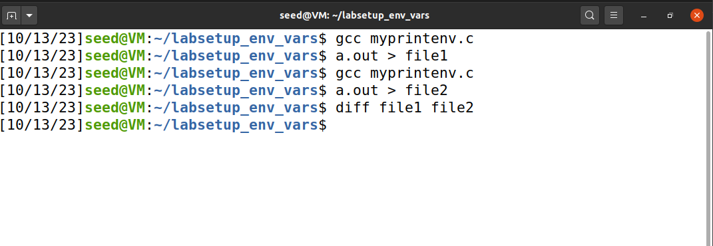
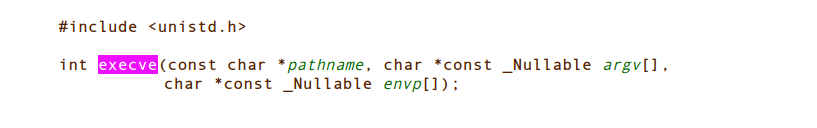
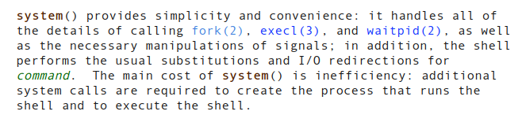

# LOGBOOK4.md

# Task1

1. Dar print às variáveis de ambiente através de `printenv` 



1. Dar print às variáveis de ambiente através de  `env`



1. Dar print a uma variável de ambiente específica através de `printenv PWD`



1. Usar o `export` 



1. Usar o `unset`



- Podemos procurar por uma variável de ambiente específica através de `printen v <variável>` ou `env | grep <variável>`
- Para criar uma nova variável de ambiente podemos utilizar `export <variável> = <valor>`
- Para remover uma nclearova variável de ambiente podemos utilizar `unset <variável>`

## Task2

1. Compilar o ficheiro myprintenv.c, correr e guardar o output para um ficheiro `output1`. 
2. Compilar o ficheiro myprintenv.c, correr e guardar o output para um ficheiro `output2`. 
3. Usar o comando `diff output1 output2` reparamos que o não existe output de nada, o que significa que não existem diferenças entre o primeiro ficheiro e o segundo logo, não existem diferenças entre as enviroment variables entre o child e o parent process.  



- Depois de usar o comando `diff` reparamos que o não existe output de nada, o que significa que não existem diferenças entre o primeiro ficheiro e o segundo logo, não existem diferenças entre as enviroment variables entre o child e o parent process.
- Assim, podemos concluir que quando usamos a system call `fork()`, as variáveis de ambiente do processo pai são inherited para o processo filho.

 

## Task3

Na tarefa 3, primeiramente compilamos o ficheiro `myenv.c`, corremos e guardamos o output para um ficheiro.

Depois substituimos o argumento NULL do `execve` para a variável `environ`, depois compilamos, corremos e guardamos o output para ficheiro diferente

Quando corremos o comando `diff (nome) (nome2)`, obtemos todas as variáveis de ambiente como output o que significa que um dos ficheiros não têm nenhuma variavel de ambiente. O que significa que podemos opcionalmente não passar as variáveis de ambiente para a imagem nova, metendo NULL como argumento do `execve`, como podemos ver na declaração da função em baixo, retirado das man pages:



## Task4

No código dado pela a tarefa 4, a função `system` é invocada com o path `/usr/bin/env` que como vimos previamente, por default, retorna todas as variáveis de sistema usadas.

Como funciona: Ao usar a função `system`, estamos a executar o commando numa shell (por exemplo `/bin/sh`) num processo filho do programa atual (e como vimos anteriormente, as variáveis de ambiente passam para o processo filho num `fork`) como podemos ver um excerto retirado das manpages do `system`



## Task5

Na tarefa 5, compilamos o ficheiro dado pela a tarefa, depois metemos o root como o proprietário do programa com: `sudo chown root <programa>`

Depois ativamos a permissão Set-UID no programa (com também as permissões para que os outros possam executar e escrever) com: `sudo chmod 4755 <programa>`

Esta permissão (Set User ID upon execution) é uma permissão especial em sistemas baseados em Unix que deixa outros utilizadores correr um programa, mas com as permissões do proprietário do programa, em vez das permissões do utilizador.

Logo, antes do programa, podemos alterar algumas váriaveis de ambiente. Algumas váriaveis como o PATH podem ser alteradas mas existem outras variáveis não podem ser alteradas

O LD_LIBRARY_PATH não é adicionado por razões de segurança visto que esta variável é responsável por especificar as diferentes librarias dinâmicas a que o sistema pode precisar de aceder. A alteração desta variável podia levar ao carregamento de librarias maliciosas que podiam dar permissões root a externos. Por essa razão, quando um programa de Set-UID é corrido o sistema entra em “secure execution mode” em que tanto a LD_LIBRARY_PATH como outras poucas “enviroment variables” são ignoradas. 

## Task6

Vamos supor o seguinte programa é compilado, tem a permissão Set-UID e o proprietário é root.

```c
int main()
{
system("ls");
return 0;
}
```

Como é que podemos explorar isto?

Já sabemos que o `system` corre numa shell, por exemplo `/bin/sh` e a shell para saber o caminho dos binários, usa a variável de ambiente `PATH` em que os primeiros diretórios é os que têm mais prioridade. 

Como o programa corre em Set-UID, podemos dar override à variável `PATH` para usar o nosso programa `ls` visto que não está com o programa absoluto, para por exemplo obtermos uma shell.