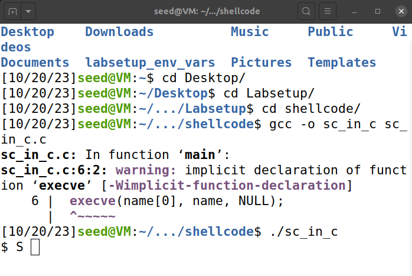
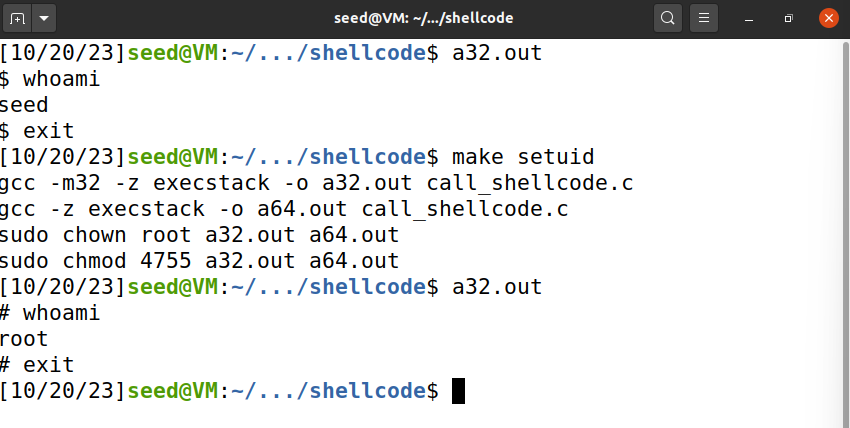
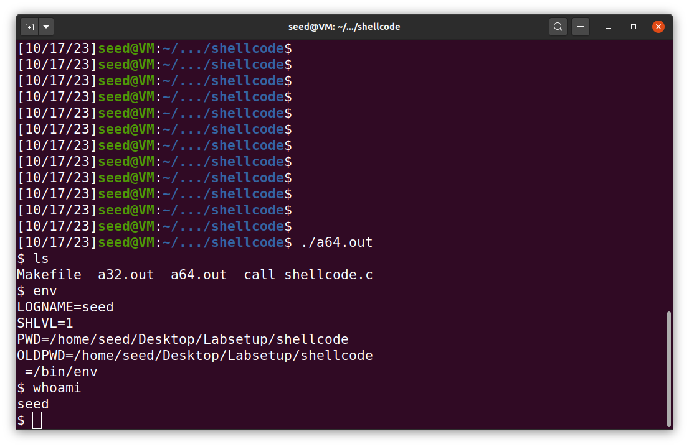
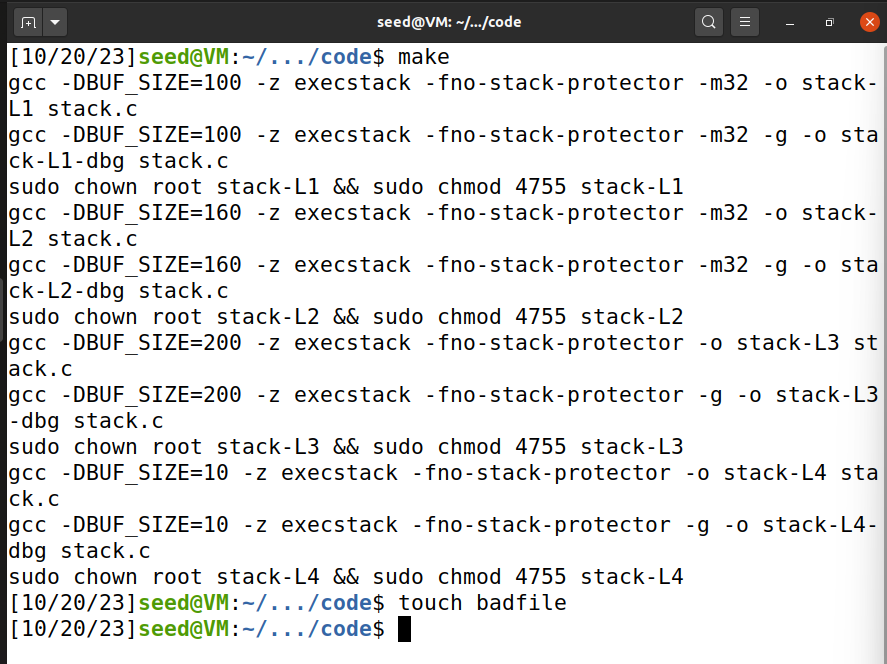
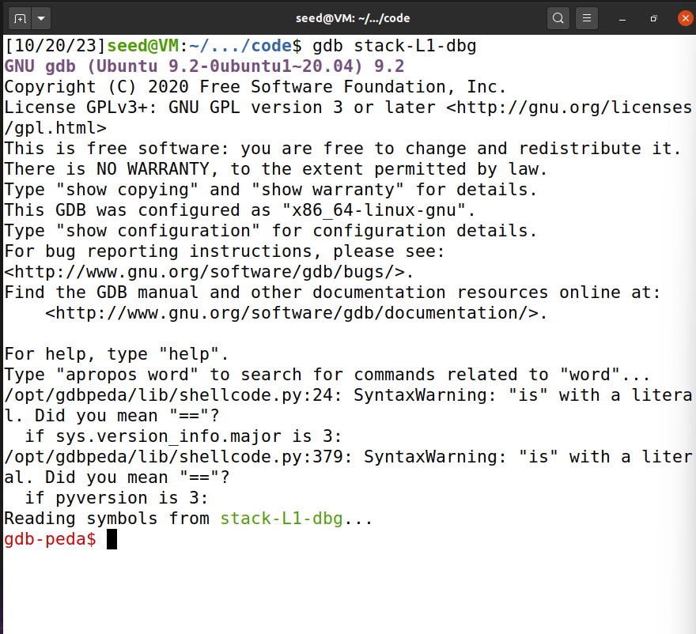
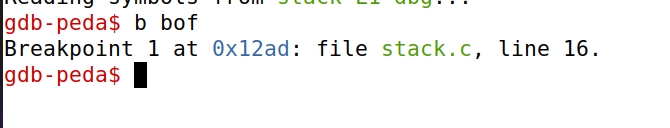
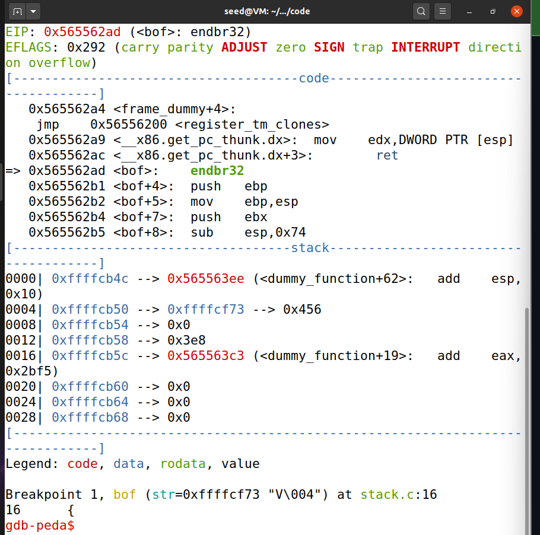
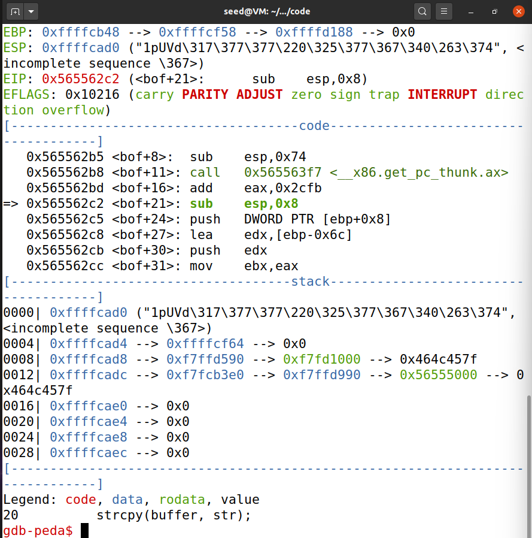
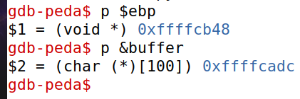

# LOGBOOK5.md

# Environment Setup

### 1. Turning Off Countermeasures

Antes de iniciar o lab, tivemos de preparar o ambiente de maneira a facilitar 

`$ sudo sysctl -w kernel.randomize_va_space=0`

Através do comando acima, podemos desativar os endereços de memória aleatórios do Linux que previnem ataques de buffer-overflow.

Com esta definição ativada, torna-se mais difícil para um atacante encontrar o endereço da heap e da stack.

Assim, o endereço do nosso shellcode é mais previsível, o que facilita a resolução do lab, visto que é uma das partes mais críticas de um ataque de buffer-overflow.

### 2. Configuring /bin/sh

`$ sudo ln -sf /bin/zsh /bin/sh`

Com este comando, o link simbólico `/bin/sh` deixa de apontar para `/bin/dash`. Esta configuração existe para impedir que existam ataques Set-UID. 

Quando o dash e o bash detetarem que estão ser executados em processos Set-UID, o id do utilizador que invocou o processo (que está a tentar fazer-se passar por um utilizador com mais permissões) é alterado para o id real do mesmo.

Tendo em conta que o ataque que vamos fazer envolve um programa Set-UID, vamos alterar esta configuração para que o `/bin/sh` redirecione para outra shell que não proteja destes ataques (neste caso, `/bin/zsh`).

# Task 1

Shellcode, bastante utilizado para ataques code-injection, é um código que dá launch a uma shell. A melhor maneira de escrever shellcode é com assmbly.

Nesta tarefa, é-nos fornecido shellcode para nos familiarizarmos com o mesmo.

Em primeiro lugar, foi-nos fornecido shellcode em C. Apesar de usualmente não se escrever shellcode em C, o programa dá launch a uma shell.

Em segundo lugar e terceiro lugar, temos shellcode em assembly, tanto de 32-bits como de 64-bits. Para ter acesso a esse código, tivemos de usar o comando `make` que gerou os executáveis.

No caso do shellcode de 32-bit, ao correr o código, demos launch a uma shell e, como podemos verificar pela utilização do comando `whoami` , estamos a executá-la como seed.

Pudemos também perceber como funciona o shellcode de 32-bit de maneira superficial. Um exemplo disto é com a linha do código `push "//sh”` , que tem duas barras visto que é necessário que a instrução tenha 32 bits, enquanto que `/sh` tem apenas 24. Conseguimos também ver que o código foi escrito de maneira a conseguirmos passar os argumentos necessários para o `execve()` através dos registos e quando é que este system call é feito.

O mesmo acontece quando usamos a shell de 64-bit, a qual também é executada como seed.

# Task 2

Nesta tarefa é-nos pedido para compilarmos o ficheiro stack.c com as flags que permitem corromper a stack (desligando a StackGuard e os non-executable stack protections) com o comando ‘gcc -DBUF_SIZE=100 -m32 -o stack -z execstack -fno-stack-protector stack.c’ (`-m32` for 32-bit compilation, `-z execstack` to allow code execution from the stack and `-fno-stack-protector` to remove any protections against buffer overflows in the stack). Para além disso também fazemos do programa root-owned ao correr os comandos (sudo ) e (sudo ) como já foi feito em labs anteriores.

Se analisarmos o ficheiro stack.c verificamos que tem uma função ‘bof’ declarada e o int main.

Nesta função ‘bof’ é usado o comando strcpy para copiar um array de char ‘str’ que é recebido por parâmetro para um buffer de tamanho BUF_SIZE (100).

Na main é criado um array ‘str’ de tamanho 517 e é declarado e aberto um file badfile o qual é lido para o array str. Str é passada como parâmetro para bof e este é copiado para o buffer. 

Neste momento ocorre o exploit pois, como a stack não tem proteção, o strcpy copia para o buffer todo o str ultrapassando a sua capacidade porque o strcpy só termina o load quando encontra um ‘\0’, escrevendo em endereços de memória em que não era suposto overwritting código com outras funcionalidades ,neste caso o exploit procura dar overwrite ao return address da função ‘bof’ de modo que todo o código da shell que foi loaded desde badfile para a stack seja executado .

## Task 3

Na Task3 procedemos a fazer um ataque no programa referido anteriormente.

Começamos por compilar o programa com todas as flags anteriormente usadas acrescentado agora a flag -g para debugging  e criamos o ficheiro para ser lido com ‘touch badfile’.

Precisamos agora de entrar em debug no terminal para ter acesso aos endereços de memória utilizando  ‘gbd stack-L1-dbg’

Entrando em modo debug criamos um breakpoint no inicio da função bof ‘b bof’, executamos o código ‘run’ até que este alcance o breakpoint

Continuamos a execução até esta parar quando strcpy é chamada.

usamos o comando ‘p $ebp’ para este printar o endereço do ebp ‘0xffffcb38’ que aqui representa também o endereço de retorno da stack frame , algo que será útil mais para a frente.

fazemos o mesmo com buffer ‘p &buffer’ e obtemos da mesma maneira o endereço onde começa o buffer, neste caso ‘0xffffcacc’

Com os endereços de ambos seremos capazes de calcular a diferença de bytes entre eles de modo a podermos dar overwrite ao endereço de retorno da função ‘bo’
